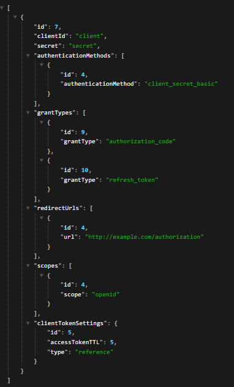
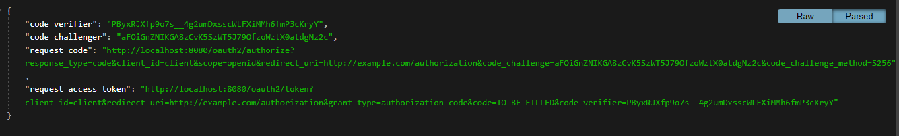

## org.springframework.security.access.AccessDeniedException: Access Denied

* After starting the application I have made `GET` to `http://localhost:8080/dynamics/client` which gave already stored
  client from db.
  
* Then another `GET` request to `http://localhost:8080/dynamics/pkce` which gave the code verifier, challenge and the requests.
  
* No exception has been occurred yet.
* Now I have made request to `http://localhost:8080/oauth2/authorize?response_type=code&client_id=client&scope=openid&redirect_uri=http://example.com/authorization&code_challenge=aFOiGnZNIKGA8zCvK5SzWT5J79OfzoWztX0atdgNz2c&code_challenge_method=S256` then just provided my user credentials and obtained the code.
* In between this process the exception is thrown which is there below in server logs.
* But I have tried to sending request to `http://localhost:8080/oauth2/token?client_id=client&redirect_uri=http://example.com/authorization&grant_type=authorization_code&code=1WV0ZB0QUsoHI1Nvc_7B_cr9sx05_6Avc_O9yMYRA-QygV0_ODImakIj9i4RgXsvgUKOpOIXqnWdSksrTXYanMtpoOR94FDEh03NRQKp9stgVUGpMLllPbHN6pCSTP_N&code_verifier=PByxRJXfp9o7s__4g2umDxsscWLFXiMMh6fmP3cKryY` with the generated code. Along with that `Basic Auth` with username `client` and secret `secret` as there in my database.
* Again this time this kind of response came which is pretty understandable as we need to pass things as `x-www-form-urlencoded`.And after passing I am getting the token.
* But could not resolve the `org.springframework.security.access.AccessDeniedException: Access Denied` exception.

> Here are the server logs

```

  .   ____          _            __ _ _
 /\\ / ___'_ __ _ _(_)_ __  __ _ \ \ \ \
( ( )\___ | '_ | '_| | '_ \/ _` | \ \ \ \
 \\/  ___)| |_)| | | | | || (_| |  ) ) ) )
  '  |____| .__|_| |_|_| |_\__, | / / / /
 =========|_|==============|___/=/_/_/_/
 :: Spring Boot ::                (v3.2.4)

2024-04-16T00:23:24.799+05:30  INFO 11816 --- [oauth2_marathon] [           main] d.a.o.Oauth2MarathonApplication          : Starting Oauth2MarathonApplication using Java 17.0.6 with PID 11816 (D:\My Codes\JAVA\SpringBoot\oauth2_marathon\build\classes\java\main started by abhis in D:\My Codes\JAVA\SpringBoot\oauth2_marathon)
2024-04-16T00:23:24.808+05:30  INFO 11816 --- [oauth2_marathon] [           main] d.a.o.Oauth2MarathonApplication          : No active profile set, falling back to 1 default profile: "default"
2024-04-16T00:23:25.911+05:30  INFO 11816 --- [oauth2_marathon] [           main] .s.d.r.c.RepositoryConfigurationDelegate : Bootstrapping Spring Data JPA repositories in DEFAULT mode.
2024-04-16T00:23:25.996+05:30  INFO 11816 --- [oauth2_marathon] [           main] .s.d.r.c.RepositoryConfigurationDelegate : Finished Spring Data repository scanning in 72 ms. Found 1 JPA repository interface.
2024-04-16T00:23:26.622+05:30  INFO 11816 --- [oauth2_marathon] [           main] o.s.b.w.embedded.tomcat.TomcatWebServer  : Tomcat initialized with port 8080 (http)
2024-04-16T00:23:26.634+05:30  INFO 11816 --- [oauth2_marathon] [           main] o.apache.catalina.core.StandardService   : Starting service [Tomcat]
2024-04-16T00:23:26.635+05:30  INFO 11816 --- [oauth2_marathon] [           main] o.apache.catalina.core.StandardEngine    : Starting Servlet engine: [Apache Tomcat/10.1.19]
2024-04-16T00:23:26.698+05:30  INFO 11816 --- [oauth2_marathon] [           main] o.a.c.c.C.[Tomcat].[localhost].[/]       : Initializing Spring embedded WebApplicationContext
2024-04-16T00:23:26.699+05:30  INFO 11816 --- [oauth2_marathon] [           main] w.s.c.ServletWebServerApplicationContext : Root WebApplicationContext: initialization completed in 1785 ms
2024-04-16T00:23:26.848+05:30  INFO 11816 --- [oauth2_marathon] [           main] com.zaxxer.hikari.HikariDataSource       : HikariPool-1 - Starting...
2024-04-16T00:23:27.334+05:30  INFO 11816 --- [oauth2_marathon] [           main] com.zaxxer.hikari.pool.HikariPool        : HikariPool-1 - Added connection com.mysql.cj.jdbc.ConnectionImpl@4ce25e47
2024-04-16T00:23:27.336+05:30  INFO 11816 --- [oauth2_marathon] [           main] com.zaxxer.hikari.HikariDataSource       : HikariPool-1 - Start completed.
2024-04-16T00:23:27.412+05:30  INFO 11816 --- [oauth2_marathon] [           main] o.hibernate.jpa.internal.util.LogHelper  : HHH000204: Processing PersistenceUnitInfo [name: default]
2024-04-16T00:23:27.510+05:30  INFO 11816 --- [oauth2_marathon] [           main] org.hibernate.Version                    : HHH000412: Hibernate ORM core version 6.4.4.Final
2024-04-16T00:23:27.594+05:30  INFO 11816 --- [oauth2_marathon] [           main] o.h.c.internal.RegionFactoryInitiator    : HHH000026: Second-level cache disabled
2024-04-16T00:23:28.140+05:30  INFO 11816 --- [oauth2_marathon] [           main] o.s.o.j.p.SpringPersistenceUnitInfo      : No LoadTimeWeaver setup: ignoring JPA class transformer
2024-04-16T00:23:29.422+05:30  INFO 11816 --- [oauth2_marathon] [           main] o.h.e.t.j.p.i.JtaPlatformInitiator       : HHH000489: No JTA platform available (set 'hibernate.transaction.jta.platform' to enable JTA platform integration)
2024-04-16T00:23:29.425+05:30  INFO 11816 --- [oauth2_marathon] [           main] j.LocalContainerEntityManagerFactoryBean : Initialized JPA EntityManagerFactory for persistence unit 'default'
2024-04-16T00:23:29.707+05:30  INFO 11816 --- [oauth2_marathon] [           main] o.s.d.j.r.query.QueryEnhancerFactory     : Hibernate is in classpath; If applicable, HQL parser will be used.
2024-04-16T00:23:30.113+05:30  WARN 11816 --- [oauth2_marathon] [           main] JpaBaseConfiguration$JpaWebConfiguration : spring.jpa.open-in-view is enabled by default. Therefore, database queries may be performed during view rendering. Explicitly configure spring.jpa.open-in-view to disable this warning
2024-04-16T00:23:30.127+05:30 TRACE 11816 --- [oauth2_marathon] [           main] eGlobalAuthenticationAutowiredConfigurer : Eagerly initializing {appConfig=dev.abhisek.oauth2_marathon.config.AppConfig$$SpringCGLIB$$0@15c3585}
2024-04-16T00:23:31.623+05:30  INFO 11816 --- [oauth2_marathon] [           main] o.s.s.web.DefaultSecurityFilterChain     : Will secure org.springframework.security.oauth2.server.authorization.config.annotation.web.configurers.OAuth2AuthorizationServerConfigurer$$Lambda$1453/0x00000008015b1120@2420e962 with [org.springframework.security.web.session.DisableEncodeUrlFilter@1fc51af7, org.springframework.security.web.context.request.async.WebAsyncManagerIntegrationFilter@66df2165, org.springframework.security.web.context.SecurityContextHolderFilter@65448932, org.springframework.security.oauth2.server.authorization.config.annotation.web.configurers.AuthorizationServerContextFilter@125447a0, org.springframework.security.web.header.HeaderWriterFilter@3b75b7b4, org.springframework.web.filter.CorsFilter@41cec7b0, org.springframework.security.web.csrf.CsrfFilter@17287458, org.springframework.security.oauth2.server.authorization.oidc.web.OidcLogoutEndpointFilter@4c1f4817, org.springframework.security.web.authentication.logout.LogoutFilter@21298c3a, org.springframework.security.oauth2.server.authorization.web.OAuth2AuthorizationServerMetadataEndpointFilter@5fc44b4b, org.springframework.security.oauth2.server.authorization.web.OAuth2AuthorizationEndpointFilter@7ec63b9a, org.springframework.security.oauth2.server.authorization.web.OAuth2DeviceVerificationEndpointFilter@1c1ee02b, org.springframework.security.oauth2.server.authorization.oidc.web.OidcProviderConfigurationEndpointFilter@7e00a43e, org.springframework.security.oauth2.server.authorization.web.NimbusJwkSetEndpointFilter@2493f9a8, org.springframework.security.oauth2.server.authorization.web.OAuth2ClientAuthenticationFilter@26acbc9d, org.springframework.security.web.savedrequest.RequestCacheAwareFilter@1acd952e, org.springframework.security.web.servletapi.SecurityContextHolderAwareRequestFilter@6da76bb1, org.springframework.security.web.authentication.AnonymousAuthenticationFilter@62065d12, org.springframework.security.web.access.ExceptionTranslationFilter@1d8e9f22, org.springframework.security.web.access.intercept.AuthorizationFilter@4b90a402, org.springframework.security.oauth2.server.authorization.web.OAuth2TokenEndpointFilter@ba4c99c, org.springframework.security.oauth2.server.authorization.web.OAuth2TokenIntrospectionEndpointFilter@482040a, org.springframework.security.oauth2.server.authorization.web.OAuth2TokenRevocationEndpointFilter@713323a3, org.springframework.security.oauth2.server.authorization.web.OAuth2DeviceAuthorizationEndpointFilter@6984f7d1, org.springframework.security.oauth2.server.authorization.oidc.web.OidcUserInfoEndpointFilter@1455d0f5]
2024-04-16T00:23:31.632+05:30  INFO 11816 --- [oauth2_marathon] [           main] o.s.s.web.DefaultSecurityFilterChain     : Will secure any request with [org.springframework.security.web.session.DisableEncodeUrlFilter@276ac94c, org.springframework.security.web.context.request.async.WebAsyncManagerIntegrationFilter@5ccc07ae, org.springframework.security.web.context.SecurityContextHolderFilter@3503e68e, org.springframework.security.web.header.HeaderWriterFilter@7c27ed2f, org.springframework.web.filter.CorsFilter@ab5e63, org.springframework.security.web.csrf.CsrfFilter@6bc45472, org.springframework.security.web.authentication.logout.LogoutFilter@4eba6e1f, org.springframework.security.web.authentication.UsernamePasswordAuthenticationFilter@5565d718, org.springframework.security.web.authentication.ui.DefaultLoginPageGeneratingFilter@7280785f, org.springframework.security.web.authentication.ui.DefaultLogoutPageGeneratingFilter@6a434cdd, org.springframework.security.web.savedrequest.RequestCacheAwareFilter@7c2d4398, org.springframework.security.web.servletapi.SecurityContextHolderAwareRequestFilter@310db5c4, org.springframework.security.web.authentication.AnonymousAuthenticationFilter@1b12c870, org.springframework.security.web.access.ExceptionTranslationFilter@160b7ccd, org.springframework.security.web.access.intercept.AuthorizationFilter@63f6811e]
2024-04-16T00:23:31.889+05:30  INFO 11816 --- [oauth2_marathon] [           main] o.s.b.w.embedded.tomcat.TomcatWebServer  : Tomcat started on port 8080 (http) with context path ''
2024-04-16T00:23:31.898+05:30  INFO 11816 --- [oauth2_marathon] [           main] d.a.o.Oauth2MarathonApplication          : Started Oauth2MarathonApplication in 7.899 seconds (process running for 9.951)
2024-04-16T00:24:24.239+05:30  INFO 11816 --- [oauth2_marathon] [nio-8080-exec-1] o.a.c.c.C.[Tomcat].[localhost].[/]       : Initializing Spring DispatcherServlet 'dispatcherServlet'
2024-04-16T00:24:24.240+05:30  INFO 11816 --- [oauth2_marathon] [nio-8080-exec-1] o.s.web.servlet.DispatcherServlet        : Initializing Servlet 'dispatcherServlet'
2024-04-16T00:24:24.242+05:30  INFO 11816 --- [oauth2_marathon] [nio-8080-exec-1] o.s.web.servlet.DispatcherServlet        : Completed initialization in 2 ms
2024-04-16T00:24:24.267+05:30 TRACE 11816 --- [oauth2_marathon] [nio-8080-exec-1] o.s.security.web.FilterChainProxy        : Trying to match request against DefaultSecurityFilterChain [RequestMatcher=org.springframework.security.oauth2.server.authorization.config.annotation.web.configurers.OAuth2AuthorizationServerConfigurer$$Lambda$1453/0x00000008015b1120@2420e962, Filters=[org.springframework.security.web.session.DisableEncodeUrlFilter@1fc51af7, org.springframework.security.web.context.request.async.WebAsyncManagerIntegrationFilter@66df2165, org.springframework.security.web.context.SecurityContextHolderFilter@65448932, org.springframework.security.oauth2.server.authorization.config.annotation.web.configurers.AuthorizationServerContextFilter@125447a0, org.springframework.security.web.header.HeaderWriterFilter@3b75b7b4, org.springframework.web.filter.CorsFilter@41cec7b0, org.springframework.security.web.csrf.CsrfFilter@17287458, org.springframework.security.oauth2.server.authorization.oidc.web.OidcLogoutEndpointFilter@4c1f4817, org.springframework.security.web.authentication.logout.LogoutFilter@21298c3a, org.springframework.security.oauth2.server.authorization.web.OAuth2AuthorizationServerMetadataEndpointFilter@5fc44b4b, org.springframework.security.oauth2.server.authorization.web.OAuth2AuthorizationEndpointFilter@7ec63b9a, org.springframework.security.oauth2.server.authorization.web.OAuth2DeviceVerificationEndpointFilter@1c1ee02b, org.springframework.security.oauth2.server.authorization.oidc.web.OidcProviderConfigurationEndpointFilter@7e00a43e, org.springframework.security.oauth2.server.authorization.web.NimbusJwkSetEndpointFilter@2493f9a8, org.springframework.security.oauth2.server.authorization.web.OAuth2ClientAuthenticationFilter@26acbc9d, org.springframework.security.web.savedrequest.RequestCacheAwareFilter@1acd952e, org.springframework.security.web.servletapi.SecurityContextHolderAwareRequestFilter@6da76bb1, org.springframework.security.web.authentication.AnonymousAuthenticationFilter@62065d12, org.springframework.security.web.access.ExceptionTranslationFilter@1d8e9f22, org.springframework.security.web.access.intercept.AuthorizationFilter@4b90a402, org.springframework.security.oauth2.server.authorization.web.OAuth2TokenEndpointFilter@ba4c99c, org.springframework.security.oauth2.server.authorization.web.OAuth2TokenIntrospectionEndpointFilter@482040a, org.springframework.security.oauth2.server.authorization.web.OAuth2TokenRevocationEndpointFilter@713323a3, org.springframework.security.oauth2.server.authorization.web.OAuth2DeviceAuthorizationEndpointFilter@6984f7d1, org.springframework.security.oauth2.server.authorization.oidc.web.OidcUserInfoEndpointFilter@1455d0f5]] (1/2)
2024-04-16T00:24:24.267+05:30 TRACE 11816 --- [oauth2_marathon] [nio-8080-exec-1] o.s.security.web.FilterChainProxy        : Trying to match request against DefaultSecurityFilterChain [RequestMatcher=any request, Filters=[org.springframework.security.web.session.DisableEncodeUrlFilter@276ac94c, org.springframework.security.web.context.request.async.WebAsyncManagerIntegrationFilter@5ccc07ae, org.springframework.security.web.context.SecurityContextHolderFilter@3503e68e, org.springframework.security.web.header.HeaderWriterFilter@7c27ed2f, org.springframework.web.filter.CorsFilter@ab5e63, org.springframework.security.web.csrf.CsrfFilter@6bc45472, org.springframework.security.web.authentication.logout.LogoutFilter@4eba6e1f, org.springframework.security.web.authentication.UsernamePasswordAuthenticationFilter@5565d718, org.springframework.security.web.authentication.ui.DefaultLoginPageGeneratingFilter@7280785f, org.springframework.security.web.authentication.ui.DefaultLogoutPageGeneratingFilter@6a434cdd, org.springframework.security.web.savedrequest.RequestCacheAwareFilter@7c2d4398, org.springframework.security.web.servletapi.SecurityContextHolderAwareRequestFilter@310db5c4, org.springframework.security.web.authentication.AnonymousAuthenticationFilter@1b12c870, org.springframework.security.web.access.ExceptionTranslationFilter@160b7ccd, org.springframework.security.web.access.intercept.AuthorizationFilter@63f6811e]] (2/2)
2024-04-16T00:24:24.268+05:30 DEBUG 11816 --- [oauth2_marathon] [nio-8080-exec-1] o.s.security.web.FilterChainProxy        : Securing GET /dynamics/client
2024-04-16T00:24:24.269+05:30 TRACE 11816 --- [oauth2_marathon] [nio-8080-exec-1] o.s.security.web.FilterChainProxy        : Invoking DisableEncodeUrlFilter (1/15)
2024-04-16T00:24:24.269+05:30 TRACE 11816 --- [oauth2_marathon] [nio-8080-exec-1] o.s.security.web.FilterChainProxy        : Invoking WebAsyncManagerIntegrationFilter (2/15)
2024-04-16T00:24:24.271+05:30 TRACE 11816 --- [oauth2_marathon] [nio-8080-exec-1] o.s.security.web.FilterChainProxy        : Invoking SecurityContextHolderFilter (3/15)
2024-04-16T00:24:24.273+05:30 TRACE 11816 --- [oauth2_marathon] [nio-8080-exec-1] o.s.security.web.FilterChainProxy        : Invoking HeaderWriterFilter (4/15)
2024-04-16T00:24:24.275+05:30 TRACE 11816 --- [oauth2_marathon] [nio-8080-exec-1] o.s.security.web.FilterChainProxy        : Invoking CorsFilter (5/15)
2024-04-16T00:24:24.276+05:30 TRACE 11816 --- [oauth2_marathon] [nio-8080-exec-1] o.s.security.web.FilterChainProxy        : Invoking CsrfFilter (6/15)
2024-04-16T00:24:24.277+05:30 TRACE 11816 --- [oauth2_marathon] [nio-8080-exec-1] o.s.security.web.csrf.CsrfFilter         : Did not protect against CSRF since request did not match And [CsrfNotRequired [TRACE, HEAD, GET, OPTIONS], Not [Or [Mvc [pattern='/dynamics/**']]]]
2024-04-16T00:24:24.278+05:30 TRACE 11816 --- [oauth2_marathon] [nio-8080-exec-1] o.s.security.web.FilterChainProxy        : Invoking LogoutFilter (7/15)
2024-04-16T00:24:24.278+05:30 TRACE 11816 --- [oauth2_marathon] [nio-8080-exec-1] o.s.s.w.a.logout.LogoutFilter            : Did not match request to Ant [pattern='/logout', POST]
2024-04-16T00:24:24.278+05:30 TRACE 11816 --- [oauth2_marathon] [nio-8080-exec-1] o.s.security.web.FilterChainProxy        : Invoking UsernamePasswordAuthenticationFilter (8/15)
2024-04-16T00:24:24.278+05:30 TRACE 11816 --- [oauth2_marathon] [nio-8080-exec-1] w.a.UsernamePasswordAuthenticationFilter : Did not match request to Ant [pattern='/login', POST]
2024-04-16T00:24:24.278+05:30 TRACE 11816 --- [oauth2_marathon] [nio-8080-exec-1] o.s.security.web.FilterChainProxy        : Invoking DefaultLoginPageGeneratingFilter (9/15)
2024-04-16T00:24:24.279+05:30 TRACE 11816 --- [oauth2_marathon] [nio-8080-exec-1] o.s.security.web.FilterChainProxy        : Invoking DefaultLogoutPageGeneratingFilter (10/15)
2024-04-16T00:24:24.279+05:30 TRACE 11816 --- [oauth2_marathon] [nio-8080-exec-1] .w.a.u.DefaultLogoutPageGeneratingFilter : Did not render default logout page since request did not match [Ant [pattern='/logout', GET]]
2024-04-16T00:24:24.279+05:30 TRACE 11816 --- [oauth2_marathon] [nio-8080-exec-1] o.s.security.web.FilterChainProxy        : Invoking RequestCacheAwareFilter (11/15)
2024-04-16T00:24:24.279+05:30 TRACE 11816 --- [oauth2_marathon] [nio-8080-exec-1] o.s.s.w.s.HttpSessionRequestCache        : matchingRequestParameterName is required for getMatchingRequest to lookup a value, but not provided
2024-04-16T00:24:24.279+05:30 TRACE 11816 --- [oauth2_marathon] [nio-8080-exec-1] o.s.security.web.FilterChainProxy        : Invoking SecurityContextHolderAwareRequestFilter (12/15)
2024-04-16T00:24:24.281+05:30 TRACE 11816 --- [oauth2_marathon] [nio-8080-exec-1] o.s.security.web.FilterChainProxy        : Invoking AnonymousAuthenticationFilter (13/15)
2024-04-16T00:24:24.282+05:30 TRACE 11816 --- [oauth2_marathon] [nio-8080-exec-1] o.s.security.web.FilterChainProxy        : Invoking ExceptionTranslationFilter (14/15)
2024-04-16T00:24:24.282+05:30 TRACE 11816 --- [oauth2_marathon] [nio-8080-exec-1] o.s.security.web.FilterChainProxy        : Invoking AuthorizationFilter (15/15)
2024-04-16T00:24:24.283+05:30 TRACE 11816 --- [oauth2_marathon] [nio-8080-exec-1] estMatcherDelegatingAuthorizationManager : Authorizing SecurityContextHolderAwareRequestWrapper[ org.springframework.security.web.header.HeaderWriterFilter$HeaderWriterRequest@24a36152]
2024-04-16T00:24:24.284+05:30 TRACE 11816 --- [oauth2_marathon] [nio-8080-exec-1] estMatcherDelegatingAuthorizationManager : Checking authorization on SecurityContextHolderAwareRequestWrapper[ org.springframework.security.web.header.HeaderWriterFilter$HeaderWriterRequest@24a36152] using org.springframework.security.config.annotation.web.configurers.AuthorizeHttpRequestsConfigurer$$Lambda$1455/0x00000008015b1d68@6c220a7
2024-04-16T00:24:24.284+05:30 DEBUG 11816 --- [oauth2_marathon] [nio-8080-exec-1] o.s.security.web.FilterChainProxy        : Secured GET /dynamics/client
2024-04-16T00:24:24.648+05:30 TRACE 11816 --- [oauth2_marathon] [nio-8080-exec-1] o.s.s.w.header.writers.HstsHeaderWriter  : Not injecting HSTS header since it did not match request to [Is Secure]
2024-04-16T00:24:24.653+05:30 TRACE 11816 --- [oauth2_marathon] [nio-8080-exec-1] w.c.HttpSessionSecurityContextRepository : No HttpSession currently exists
2024-04-16T00:24:24.653+05:30 TRACE 11816 --- [oauth2_marathon] [nio-8080-exec-1] .s.s.w.c.SupplierDeferredSecurityContext : Created SecurityContextImpl [Null authentication]
2024-04-16T00:24:24.653+05:30 TRACE 11816 --- [oauth2_marathon] [nio-8080-exec-1] .s.s.w.c.SupplierDeferredSecurityContext : Created SecurityContextImpl [Null authentication]
2024-04-16T00:24:24.654+05:30 TRACE 11816 --- [oauth2_marathon] [nio-8080-exec-1] o.s.s.w.a.AnonymousAuthenticationFilter  : Set SecurityContextHolder to AnonymousAuthenticationToken [Principal=anonymousUser, Credentials=[PROTECTED], Authenticated=true, Details=WebAuthenticationDetails [RemoteIpAddress=0:0:0:0:0:0:0:1, SessionId=null], Granted Authorities=[ROLE_ANONYMOUS]]
2024-04-16T00:32:29.103+05:30 TRACE 11816 --- [oauth2_marathon] [nio-8080-exec-9] o.s.security.web.FilterChainProxy        : Trying to match request against DefaultSecurityFilterChain [RequestMatcher=org.springframework.security.oauth2.server.authorization.config.annotation.web.configurers.OAuth2AuthorizationServerConfigurer$$Lambda$1453/0x00000008015b1120@2420e962, Filters=[org.springframework.security.web.session.DisableEncodeUrlFilter@1fc51af7, org.springframework.security.web.context.request.async.WebAsyncManagerIntegrationFilter@66df2165, org.springframework.security.web.context.SecurityContextHolderFilter@65448932, org.springframework.security.oauth2.server.authorization.config.annotation.web.configurers.AuthorizationServerContextFilter@125447a0, org.springframework.security.web.header.HeaderWriterFilter@3b75b7b4, org.springframework.web.filter.CorsFilter@41cec7b0, org.springframework.security.web.csrf.CsrfFilter@17287458, org.springframework.security.oauth2.server.authorization.oidc.web.OidcLogoutEndpointFilter@4c1f4817, org.springframework.security.web.authentication.logout.LogoutFilter@21298c3a, org.springframework.security.oauth2.server.authorization.web.OAuth2AuthorizationServerMetadataEndpointFilter@5fc44b4b, org.springframework.security.oauth2.server.authorization.web.OAuth2AuthorizationEndpointFilter@7ec63b9a, org.springframework.security.oauth2.server.authorization.web.OAuth2DeviceVerificationEndpointFilter@1c1ee02b, org.springframework.security.oauth2.server.authorization.oidc.web.OidcProviderConfigurationEndpointFilter@7e00a43e, org.springframework.security.oauth2.server.authorization.web.NimbusJwkSetEndpointFilter@2493f9a8, org.springframework.security.oauth2.server.authorization.web.OAuth2ClientAuthenticationFilter@26acbc9d, org.springframework.security.web.savedrequest.RequestCacheAwareFilter@1acd952e, org.springframework.security.web.servletapi.SecurityContextHolderAwareRequestFilter@6da76bb1, org.springframework.security.web.authentication.AnonymousAuthenticationFilter@62065d12, org.springframework.security.web.access.ExceptionTranslationFilter@1d8e9f22, org.springframework.security.web.access.intercept.AuthorizationFilter@4b90a402, org.springframework.security.oauth2.server.authorization.web.OAuth2TokenEndpointFilter@ba4c99c, org.springframework.security.oauth2.server.authorization.web.OAuth2TokenIntrospectionEndpointFilter@482040a, org.springframework.security.oauth2.server.authorization.web.OAuth2TokenRevocationEndpointFilter@713323a3, org.springframework.security.oauth2.server.authorization.web.OAuth2DeviceAuthorizationEndpointFilter@6984f7d1, org.springframework.security.oauth2.server.authorization.oidc.web.OidcUserInfoEndpointFilter@1455d0f5]] (1/2)
2024-04-16T00:32:29.119+05:30 TRACE 11816 --- [oauth2_marathon] [nio-8080-exec-9] o.s.security.web.FilterChainProxy        : Trying to match request against DefaultSecurityFilterChain [RequestMatcher=any request, Filters=[org.springframework.security.web.session.DisableEncodeUrlFilter@276ac94c, org.springframework.security.web.context.request.async.WebAsyncManagerIntegrationFilter@5ccc07ae, org.springframework.security.web.context.SecurityContextHolderFilter@3503e68e, org.springframework.security.web.header.HeaderWriterFilter@7c27ed2f, org.springframework.web.filter.CorsFilter@ab5e63, org.springframework.security.web.csrf.CsrfFilter@6bc45472, org.springframework.security.web.authentication.logout.LogoutFilter@4eba6e1f, org.springframework.security.web.authentication.UsernamePasswordAuthenticationFilter@5565d718, org.springframework.security.web.authentication.ui.DefaultLoginPageGeneratingFilter@7280785f, org.springframework.security.web.authentication.ui.DefaultLogoutPageGeneratingFilter@6a434cdd, org.springframework.security.web.savedrequest.RequestCacheAwareFilter@7c2d4398, org.springframework.security.web.servletapi.SecurityContextHolderAwareRequestFilter@310db5c4, org.springframework.security.web.authentication.AnonymousAuthenticationFilter@1b12c870, org.springframework.security.web.access.ExceptionTranslationFilter@160b7ccd, org.springframework.security.web.access.intercept.AuthorizationFilter@63f6811e]] (2/2)
2024-04-16T00:32:29.120+05:30 DEBUG 11816 --- [oauth2_marathon] [nio-8080-exec-9] o.s.security.web.FilterChainProxy        : Securing GET /dynamics/pkce
2024-04-16T00:32:29.120+05:30 TRACE 11816 --- [oauth2_marathon] [nio-8080-exec-9] o.s.security.web.FilterChainProxy        : Invoking DisableEncodeUrlFilter (1/15)
2024-04-16T00:32:29.121+05:30 TRACE 11816 --- [oauth2_marathon] [nio-8080-exec-9] o.s.security.web.FilterChainProxy        : Invoking WebAsyncManagerIntegrationFilter (2/15)
2024-04-16T00:32:29.122+05:30 TRACE 11816 --- [oauth2_marathon] [nio-8080-exec-9] o.s.security.web.FilterChainProxy        : Invoking SecurityContextHolderFilter (3/15)
2024-04-16T00:32:29.122+05:30 TRACE 11816 --- [oauth2_marathon] [nio-8080-exec-9] o.s.security.web.FilterChainProxy        : Invoking HeaderWriterFilter (4/15)
2024-04-16T00:32:29.123+05:30 TRACE 11816 --- [oauth2_marathon] [nio-8080-exec-9] o.s.security.web.FilterChainProxy        : Invoking CorsFilter (5/15)
2024-04-16T00:32:29.124+05:30 TRACE 11816 --- [oauth2_marathon] [nio-8080-exec-9] o.s.security.web.FilterChainProxy        : Invoking CsrfFilter (6/15)
2024-04-16T00:32:29.125+05:30 TRACE 11816 --- [oauth2_marathon] [nio-8080-exec-9] o.s.security.web.csrf.CsrfFilter         : Did not protect against CSRF since request did not match And [CsrfNotRequired [TRACE, HEAD, GET, OPTIONS], Not [Or [Mvc [pattern='/dynamics/**']]]]
2024-04-16T00:32:29.126+05:30 TRACE 11816 --- [oauth2_marathon] [nio-8080-exec-9] o.s.security.web.FilterChainProxy        : Invoking LogoutFilter (7/15)
2024-04-16T00:32:29.127+05:30 TRACE 11816 --- [oauth2_marathon] [nio-8080-exec-9] o.s.s.w.a.logout.LogoutFilter            : Did not match request to Ant [pattern='/logout', POST]
2024-04-16T00:32:29.127+05:30 TRACE 11816 --- [oauth2_marathon] [nio-8080-exec-9] o.s.security.web.FilterChainProxy        : Invoking UsernamePasswordAuthenticationFilter (8/15)
2024-04-16T00:32:29.127+05:30 TRACE 11816 --- [oauth2_marathon] [nio-8080-exec-9] w.a.UsernamePasswordAuthenticationFilter : Did not match request to Ant [pattern='/login', POST]
2024-04-16T00:32:29.128+05:30 TRACE 11816 --- [oauth2_marathon] [nio-8080-exec-9] o.s.security.web.FilterChainProxy        : Invoking DefaultLoginPageGeneratingFilter (9/15)
2024-04-16T00:32:29.130+05:30 TRACE 11816 --- [oauth2_marathon] [nio-8080-exec-9] o.s.security.web.FilterChainProxy        : Invoking DefaultLogoutPageGeneratingFilter (10/15)
2024-04-16T00:32:29.130+05:30 TRACE 11816 --- [oauth2_marathon] [nio-8080-exec-9] .w.a.u.DefaultLogoutPageGeneratingFilter : Did not render default logout page since request did not match [Ant [pattern='/logout', GET]]
2024-04-16T00:32:29.130+05:30 TRACE 11816 --- [oauth2_marathon] [nio-8080-exec-9] o.s.security.web.FilterChainProxy        : Invoking RequestCacheAwareFilter (11/15)
2024-04-16T00:32:29.130+05:30 TRACE 11816 --- [oauth2_marathon] [nio-8080-exec-9] o.s.s.w.s.HttpSessionRequestCache        : matchingRequestParameterName is required for getMatchingRequest to lookup a value, but not provided
2024-04-16T00:32:29.131+05:30 TRACE 11816 --- [oauth2_marathon] [nio-8080-exec-9] o.s.security.web.FilterChainProxy        : Invoking SecurityContextHolderAwareRequestFilter (12/15)
2024-04-16T00:32:29.131+05:30 TRACE 11816 --- [oauth2_marathon] [nio-8080-exec-9] o.s.security.web.FilterChainProxy        : Invoking AnonymousAuthenticationFilter (13/15)
2024-04-16T00:32:29.132+05:30 TRACE 11816 --- [oauth2_marathon] [nio-8080-exec-9] o.s.security.web.FilterChainProxy        : Invoking ExceptionTranslationFilter (14/15)
2024-04-16T00:32:29.132+05:30 TRACE 11816 --- [oauth2_marathon] [nio-8080-exec-9] o.s.security.web.FilterChainProxy        : Invoking AuthorizationFilter (15/15)
2024-04-16T00:32:29.132+05:30 TRACE 11816 --- [oauth2_marathon] [nio-8080-exec-9] estMatcherDelegatingAuthorizationManager : Authorizing SecurityContextHolderAwareRequestWrapper[ org.springframework.security.web.header.HeaderWriterFilter$HeaderWriterRequest@5a07749f]
2024-04-16T00:32:29.132+05:30 TRACE 11816 --- [oauth2_marathon] [nio-8080-exec-9] estMatcherDelegatingAuthorizationManager : Checking authorization on SecurityContextHolderAwareRequestWrapper[ org.springframework.security.web.header.HeaderWriterFilter$HeaderWriterRequest@5a07749f] using org.springframework.security.config.annotation.web.configurers.AuthorizeHttpRequestsConfigurer$$Lambda$1455/0x00000008015b1d68@6c220a7
2024-04-16T00:32:29.133+05:30 DEBUG 11816 --- [oauth2_marathon] [nio-8080-exec-9] o.s.security.web.FilterChainProxy        : Secured GET /dynamics/pkce
2024-04-16T00:32:29.369+05:30 TRACE 11816 --- [oauth2_marathon] [nio-8080-exec-9] o.s.s.w.header.writers.HstsHeaderWriter  : Not injecting HSTS header since it did not match request to [Is Secure]
2024-04-16T00:32:29.378+05:30 TRACE 11816 --- [oauth2_marathon] [nio-8080-exec-9] w.c.HttpSessionSecurityContextRepository : No HttpSession currently exists
2024-04-16T00:32:29.378+05:30 TRACE 11816 --- [oauth2_marathon] [nio-8080-exec-9] .s.s.w.c.SupplierDeferredSecurityContext : Created SecurityContextImpl [Null authentication]
2024-04-16T00:32:29.378+05:30 TRACE 11816 --- [oauth2_marathon] [nio-8080-exec-9] .s.s.w.c.SupplierDeferredSecurityContext : Created SecurityContextImpl [Null authentication]
2024-04-16T00:32:29.379+05:30 TRACE 11816 --- [oauth2_marathon] [nio-8080-exec-9] o.s.s.w.a.AnonymousAuthenticationFilter  : Set SecurityContextHolder to AnonymousAuthenticationToken [Principal=anonymousUser, Credentials=[PROTECTED], Authenticated=true, Details=WebAuthenticationDetails [RemoteIpAddress=0:0:0:0:0:0:0:1, SessionId=null], Granted Authorities=[ROLE_ANONYMOUS]]
2024-04-16T00:40:34.085+05:30 TRACE 11816 --- [oauth2_marathon] [nio-8080-exec-6] o.s.security.web.FilterChainProxy        : Trying to match request against DefaultSecurityFilterChain [RequestMatcher=org.springframework.security.oauth2.server.authorization.config.annotation.web.configurers.OAuth2AuthorizationServerConfigurer$$Lambda$1453/0x00000008015b1120@2420e962, Filters=[org.springframework.security.web.session.DisableEncodeUrlFilter@1fc51af7, org.springframework.security.web.context.request.async.WebAsyncManagerIntegrationFilter@66df2165, org.springframework.security.web.context.SecurityContextHolderFilter@65448932, org.springframework.security.oauth2.server.authorization.config.annotation.web.configurers.AuthorizationServerContextFilter@125447a0, org.springframework.security.web.header.HeaderWriterFilter@3b75b7b4, org.springframework.web.filter.CorsFilter@41cec7b0, org.springframework.security.web.csrf.CsrfFilter@17287458, org.springframework.security.oauth2.server.authorization.oidc.web.OidcLogoutEndpointFilter@4c1f4817, org.springframework.security.web.authentication.logout.LogoutFilter@21298c3a, org.springframework.security.oauth2.server.authorization.web.OAuth2AuthorizationServerMetadataEndpointFilter@5fc44b4b, org.springframework.security.oauth2.server.authorization.web.OAuth2AuthorizationEndpointFilter@7ec63b9a, org.springframework.security.oauth2.server.authorization.web.OAuth2DeviceVerificationEndpointFilter@1c1ee02b, org.springframework.security.oauth2.server.authorization.oidc.web.OidcProviderConfigurationEndpointFilter@7e00a43e, org.springframework.security.oauth2.server.authorization.web.NimbusJwkSetEndpointFilter@2493f9a8, org.springframework.security.oauth2.server.authorization.web.OAuth2ClientAuthenticationFilter@26acbc9d, org.springframework.security.web.savedrequest.RequestCacheAwareFilter@1acd952e, org.springframework.security.web.servletapi.SecurityContextHolderAwareRequestFilter@6da76bb1, org.springframework.security.web.authentication.AnonymousAuthenticationFilter@62065d12, org.springframework.security.web.access.ExceptionTranslationFilter@1d8e9f22, org.springframework.security.web.access.intercept.AuthorizationFilter@4b90a402, org.springframework.security.oauth2.server.authorization.web.OAuth2TokenEndpointFilter@ba4c99c, org.springframework.security.oauth2.server.authorization.web.OAuth2TokenIntrospectionEndpointFilter@482040a, org.springframework.security.oauth2.server.authorization.web.OAuth2TokenRevocationEndpointFilter@713323a3, org.springframework.security.oauth2.server.authorization.web.OAuth2DeviceAuthorizationEndpointFilter@6984f7d1, org.springframework.security.oauth2.server.authorization.oidc.web.OidcUserInfoEndpointFilter@1455d0f5]] (1/2)
2024-04-16T00:40:34.099+05:30 DEBUG 11816 --- [oauth2_marathon] [nio-8080-exec-6] o.s.security.web.FilterChainProxy        : Securing GET /oauth2/authorize?response_type=code&client_id=client&scope=openid&redirect_uri=http://example.com/authorization&code_challenge=aFOiGnZNIKGA8zCvK5SzWT5J79OfzoWztX0atdgNz2c&code_challenge_method=S256
2024-04-16T00:40:34.099+05:30 TRACE 11816 --- [oauth2_marathon] [nio-8080-exec-6] o.s.security.web.FilterChainProxy        : Invoking DisableEncodeUrlFilter (1/25)
2024-04-16T00:40:34.100+05:30 TRACE 11816 --- [oauth2_marathon] [nio-8080-exec-6] o.s.security.web.FilterChainProxy        : Invoking WebAsyncManagerIntegrationFilter (2/25)
2024-04-16T00:40:34.101+05:30 TRACE 11816 --- [oauth2_marathon] [nio-8080-exec-6] o.s.security.web.FilterChainProxy        : Invoking SecurityContextHolderFilter (3/25)
2024-04-16T00:40:34.104+05:30 TRACE 11816 --- [oauth2_marathon] [nio-8080-exec-6] o.s.security.web.FilterChainProxy        : Invoking AuthorizationServerContextFilter (4/25)
2024-04-16T00:40:34.142+05:30 TRACE 11816 --- [oauth2_marathon] [nio-8080-exec-6] o.s.security.web.FilterChainProxy        : Invoking HeaderWriterFilter (5/25)
2024-04-16T00:40:34.142+05:30 TRACE 11816 --- [oauth2_marathon] [nio-8080-exec-6] o.s.security.web.FilterChainProxy        : Invoking CorsFilter (6/25)
2024-04-16T00:40:34.143+05:30 TRACE 11816 --- [oauth2_marathon] [nio-8080-exec-6] o.s.security.web.FilterChainProxy        : Invoking CsrfFilter (7/25)
2024-04-16T00:40:34.144+05:30 TRACE 11816 --- [oauth2_marathon] [nio-8080-exec-6] o.s.security.web.csrf.CsrfFilter         : Did not protect against CSRF since request did not match And [CsrfNotRequired [TRACE, HEAD, GET, OPTIONS], Not [Or [org.springframework.security.oauth2.server.authorization.config.annotation.web.configurers.OAuth2AuthorizationServerConfigurer$$Lambda$1453/0x00000008015b1120@2420e962]]]
2024-04-16T00:40:34.145+05:30 TRACE 11816 --- [oauth2_marathon] [nio-8080-exec-6] o.s.security.web.FilterChainProxy        : Invoking OidcLogoutEndpointFilter (8/25)
2024-04-16T00:40:34.146+05:30 TRACE 11816 --- [oauth2_marathon] [nio-8080-exec-6] o.s.security.web.FilterChainProxy        : Invoking LogoutFilter (9/25)
2024-04-16T00:40:34.146+05:30 TRACE 11816 --- [oauth2_marathon] [nio-8080-exec-6] o.s.s.w.a.logout.LogoutFilter            : Did not match request to Ant [pattern='/logout', POST]
2024-04-16T00:40:34.148+05:30 TRACE 11816 --- [oauth2_marathon] [nio-8080-exec-6] o.s.security.web.FilterChainProxy        : Invoking OAuth2AuthorizationServerMetadataEndpointFilter (10/25)
2024-04-16T00:40:34.149+05:30 TRACE 11816 --- [oauth2_marathon] [nio-8080-exec-6] o.s.security.web.FilterChainProxy        : Invoking OAuth2AuthorizationEndpointFilter (11/25)
2024-04-16T00:40:34.192+05:30 TRACE 11816 --- [oauth2_marathon] [nio-8080-exec-6] w.c.HttpSessionSecurityContextRepository : No HttpSession currently exists
2024-04-16T00:40:34.192+05:30 TRACE 11816 --- [oauth2_marathon] [nio-8080-exec-6] .s.s.w.c.SupplierDeferredSecurityContext : Created SecurityContextImpl [Null authentication]
2024-04-16T00:40:34.192+05:30 TRACE 11816 --- [oauth2_marathon] [nio-8080-exec-6] .s.s.w.c.SupplierDeferredSecurityContext : Created SecurityContextImpl [Null authentication]
2024-04-16T00:40:34.202+05:30 TRACE 11816 --- [oauth2_marathon] [nio-8080-exec-6] o.s.s.authentication.ProviderManager     : Authenticating request with OAuth2AuthorizationCodeRequestAuthenticationProvider (1/17)
2024-04-16T00:40:34.826+05:30 TRACE 11816 --- [oauth2_marathon] [nio-8080-exec-6] izationCodeRequestAuthenticationProvider : Retrieved registered client
2024-04-16T00:40:34.873+05:30 TRACE 11816 --- [oauth2_marathon] [nio-8080-exec-6] izationCodeRequestAuthenticationProvider : Validated authorization code request parameters
2024-04-16T00:40:34.874+05:30 TRACE 11816 --- [oauth2_marathon] [nio-8080-exec-6] izationCodeRequestAuthenticationProvider : Did not authenticate authorization code request since principal not authenticated
2024-04-16T00:40:34.887+05:30 TRACE 11816 --- [oauth2_marathon] [nio-8080-exec-6] o.s.security.web.FilterChainProxy        : Invoking OAuth2DeviceVerificationEndpointFilter (12/25)
2024-04-16T00:40:34.888+05:30 TRACE 11816 --- [oauth2_marathon] [nio-8080-exec-6] o.s.security.web.FilterChainProxy        : Invoking OidcProviderConfigurationEndpointFilter (13/25)
2024-04-16T00:40:34.888+05:30 TRACE 11816 --- [oauth2_marathon] [nio-8080-exec-6] o.s.security.web.FilterChainProxy        : Invoking NimbusJwkSetEndpointFilter (14/25)
2024-04-16T00:40:34.888+05:30 TRACE 11816 --- [oauth2_marathon] [nio-8080-exec-6] o.s.security.web.FilterChainProxy        : Invoking OAuth2ClientAuthenticationFilter (15/25)
2024-04-16T00:40:34.888+05:30 TRACE 11816 --- [oauth2_marathon] [nio-8080-exec-6] o.s.security.web.FilterChainProxy        : Invoking RequestCacheAwareFilter (16/25)
2024-04-16T00:40:34.890+05:30 TRACE 11816 --- [oauth2_marathon] [nio-8080-exec-6] o.s.s.w.s.HttpSessionRequestCache        : matchingRequestParameterName is required for getMatchingRequest to lookup a value, but not provided
2024-04-16T00:40:34.890+05:30 TRACE 11816 --- [oauth2_marathon] [nio-8080-exec-6] o.s.security.web.FilterChainProxy        : Invoking SecurityContextHolderAwareRequestFilter (17/25)
2024-04-16T00:40:34.890+05:30 TRACE 11816 --- [oauth2_marathon] [nio-8080-exec-6] o.s.security.web.FilterChainProxy        : Invoking AnonymousAuthenticationFilter (18/25)
2024-04-16T00:40:34.891+05:30 TRACE 11816 --- [oauth2_marathon] [nio-8080-exec-6] o.s.security.web.FilterChainProxy        : Invoking ExceptionTranslationFilter (19/25)
2024-04-16T00:40:34.892+05:30 TRACE 11816 --- [oauth2_marathon] [nio-8080-exec-6] o.s.security.web.FilterChainProxy        : Invoking AuthorizationFilter (20/25)
2024-04-16T00:40:34.892+05:30 TRACE 11816 --- [oauth2_marathon] [nio-8080-exec-6] estMatcherDelegatingAuthorizationManager : Authorizing SecurityContextHolderAwareRequestWrapper[ org.springframework.security.web.header.HeaderWriterFilter$HeaderWriterRequest@3bbbfb67]
2024-04-16T00:40:34.893+05:30 TRACE 11816 --- [oauth2_marathon] [nio-8080-exec-6] estMatcherDelegatingAuthorizationManager : Checking authorization on SecurityContextHolderAwareRequestWrapper[ org.springframework.security.web.header.HeaderWriterFilter$HeaderWriterRequest@3bbbfb67] using org.springframework.security.authorization.AuthenticatedAuthorizationManager@4cc5ff53
2024-04-16T00:40:34.896+05:30 TRACE 11816 --- [oauth2_marathon] [nio-8080-exec-6] o.s.s.w.a.AnonymousAuthenticationFilter  : Set SecurityContextHolder to AnonymousAuthenticationToken [Principal=anonymousUser, Credentials=[PROTECTED], Authenticated=true, Details=WebAuthenticationDetails [RemoteIpAddress=0:0:0:0:0:0:0:1, SessionId=null], Granted Authorities=[ROLE_ANONYMOUS]]
2024-04-16T00:40:34.902+05:30 TRACE 11816 --- [oauth2_marathon] [nio-8080-exec-6] o.s.s.w.a.ExceptionTranslationFilter     : Sending AnonymousAuthenticationToken [Principal=anonymousUser, Credentials=[PROTECTED], Authenticated=true, Details=WebAuthenticationDetails [RemoteIpAddress=0:0:0:0:0:0:0:1, SessionId=null], Granted Authorities=[ROLE_ANONYMOUS]] to authentication entry point since access is denied

org.springframework.security.access.AccessDeniedException: Access Denied
	at org.springframework.security.web.access.intercept.AuthorizationFilter.doFilter(AuthorizationFilter.java:98) ~[spring-security-web-6.2.3.jar:6.2.3]
	at org.springframework.security.web.FilterChainProxy$VirtualFilterChain.doFilter(FilterChainProxy.java:374) ~[spring-security-web-6.2.3.jar:6.2.3]
	at org.springframework.security.web.access.ExceptionTranslationFilter.doFilter(ExceptionTranslationFilter.java:126) ~[spring-security-web-6.2.3.jar:6.2.3]
	at org.springframework.security.web.access.ExceptionTranslationFilter.doFilter(ExceptionTranslationFilter.java:120) ~[spring-security-web-6.2.3.jar:6.2.3]
	at org.springframework.security.web.FilterChainProxy$VirtualFilterChain.doFilter(FilterChainProxy.java:374) ~[spring-security-web-6.2.3.jar:6.2.3]
	at org.springframework.security.web.authentication.AnonymousAuthenticationFilter.doFilter(AnonymousAuthenticationFilter.java:100) ~[spring-security-web-6.2.3.jar:6.2.3]
	at org.springframework.security.web.FilterChainProxy$VirtualFilterChain.doFilter(FilterChainProxy.java:374) ~[spring-security-web-6.2.3.jar:6.2.3]
	at org.springframework.security.web.servletapi.SecurityContextHolderAwareRequestFilter.doFilter(SecurityContextHolderAwareRequestFilter.java:179) ~[spring-security-web-6.2.3.jar:6.2.3]
	at org.springframework.security.web.FilterChainProxy$VirtualFilterChain.doFilter(FilterChainProxy.java:374) ~[spring-security-web-6.2.3.jar:6.2.3]
	at org.springframework.security.web.savedrequest.RequestCacheAwareFilter.doFilter(RequestCacheAwareFilter.java:63) ~[spring-security-web-6.2.3.jar:6.2.3]
	at org.springframework.security.web.FilterChainProxy$VirtualFilterChain.doFilter(FilterChainProxy.java:374) ~[spring-security-web-6.2.3.jar:6.2.3]
	at org.springframework.security.oauth2.server.authorization.web.OAuth2ClientAuthenticationFilter.doFilterInternal(OAuth2ClientAuthenticationFilter.java:110) ~[spring-security-oauth2-authorization-server-1.2.3.jar:1.2.3]
	at org.springframework.web.filter.OncePerRequestFilter.doFilter(OncePerRequestFilter.java:116) ~[spring-web-6.1.5.jar:6.1.5]
	at org.springframework.security.web.FilterChainProxy$VirtualFilterChain.doFilter(FilterChainProxy.java:374) ~[spring-security-web-6.2.3.jar:6.2.3]
	at org.springframework.security.oauth2.server.authorization.web.NimbusJwkSetEndpointFilter.doFilterInternal(NimbusJwkSetEndpointFilter.java:85) ~[spring-security-oauth2-authorization-server-1.2.3.jar:1.2.3]
	at org.springframework.web.filter.OncePerRequestFilter.doFilter(OncePerRequestFilter.java:116) ~[spring-web-6.1.5.jar:6.1.5]
	at org.springframework.security.web.FilterChainProxy$VirtualFilterChain.doFilter(FilterChainProxy.java:374) ~[spring-security-web-6.2.3.jar:6.2.3]
	at org.springframework.security.oauth2.server.authorization.oidc.web.OidcProviderConfigurationEndpointFilter.doFilterInternal(OidcProviderConfigurationEndpointFilter.java:86) ~[spring-security-oauth2-authorization-server-1.2.3.jar:1.2.3]
	at org.springframework.web.filter.OncePerRequestFilter.doFilter(OncePerRequestFilter.java:116) ~[spring-web-6.1.5.jar:6.1.5]
	at org.springframework.security.web.FilterChainProxy$VirtualFilterChain.doFilter(FilterChainProxy.java:374) ~[spring-security-web-6.2.3.jar:6.2.3]
	at org.springframework.security.oauth2.server.authorization.web.OAuth2DeviceVerificationEndpointFilter.doFilterInternal(OAuth2DeviceVerificationEndpointFilter.java:139) ~[spring-security-oauth2-authorization-server-1.2.3.jar:1.2.3]
	at org.springframework.web.filter.OncePerRequestFilter.doFilter(OncePerRequestFilter.java:116) ~[spring-web-6.1.5.jar:6.1.5]
	at org.springframework.security.web.FilterChainProxy$VirtualFilterChain.doFilter(FilterChainProxy.java:374) ~[spring-security-web-6.2.3.jar:6.2.3]
	at org.springframework.security.oauth2.server.authorization.web.OAuth2AuthorizationEndpointFilter.doFilterInternal(OAuth2AuthorizationEndpointFilter.java:173) ~[spring-security-oauth2-authorization-server-1.2.3.jar:1.2.3]
	at org.springframework.web.filter.OncePerRequestFilter.doFilter(OncePerRequestFilter.java:116) ~[spring-web-6.1.5.jar:6.1.5]
	at org.springframework.security.web.FilterChainProxy$VirtualFilterChain.doFilter(FilterChainProxy.java:374) ~[spring-security-web-6.2.3.jar:6.2.3]
	at org.springframework.security.oauth2.server.authorization.web.OAuth2AuthorizationServerMetadataEndpointFilter.doFilterInternal(OAuth2AuthorizationServerMetadataEndpointFilter.java:84) ~[spring-security-oauth2-authorization-server-1.2.3.jar:1.2.3]
	at org.springframework.web.filter.OncePerRequestFilter.doFilter(OncePerRequestFilter.java:116) ~[spring-web-6.1.5.jar:6.1.5]
	at org.springframework.security.web.FilterChainProxy$VirtualFilterChain.doFilter(FilterChainProxy.java:374) ~[spring-security-web-6.2.3.jar:6.2.3]
	at org.springframework.security.web.authentication.logout.LogoutFilter.doFilter(LogoutFilter.java:107) ~[spring-security-web-6.2.3.jar:6.2.3]
	at org.springframework.security.web.authentication.logout.LogoutFilter.doFilter(LogoutFilter.java:93) ~[spring-security-web-6.2.3.jar:6.2.3]
	at org.springframework.security.web.FilterChainProxy$VirtualFilterChain.doFilter(FilterChainProxy.java:374) ~[spring-security-web-6.2.3.jar:6.2.3]
	at org.springframework.security.oauth2.server.authorization.oidc.web.OidcLogoutEndpointFilter.doFilterInternal(OidcLogoutEndpointFilter.java:117) ~[spring-security-oauth2-authorization-server-1.2.3.jar:1.2.3]
	at org.springframework.web.filter.OncePerRequestFilter.doFilter(OncePerRequestFilter.java:116) ~[spring-web-6.1.5.jar:6.1.5]
	at org.springframework.security.web.FilterChainProxy$VirtualFilterChain.doFilter(FilterChainProxy.java:374) ~[spring-security-web-6.2.3.jar:6.2.3]
	at org.springframework.security.web.csrf.CsrfFilter.doFilterInternal(CsrfFilter.java:117) ~[spring-security-web-6.2.3.jar:6.2.3]
	at org.springframework.web.filter.OncePerRequestFilter.doFilter(OncePerRequestFilter.java:116) ~[spring-web-6.1.5.jar:6.1.5]
	at org.springframework.security.web.FilterChainProxy$VirtualFilterChain.doFilter(FilterChainProxy.java:374) ~[spring-security-web-6.2.3.jar:6.2.3]
	at org.springframework.web.filter.CorsFilter.doFilterInternal(CorsFilter.java:91) ~[spring-web-6.1.5.jar:6.1.5]
	at org.springframework.web.filter.OncePerRequestFilter.doFilter(OncePerRequestFilter.java:116) ~[spring-web-6.1.5.jar:6.1.5]
	at org.springframework.security.web.FilterChainProxy$VirtualFilterChain.doFilter(FilterChainProxy.java:374) ~[spring-security-web-6.2.3.jar:6.2.3]
	at org.springframework.security.web.header.HeaderWriterFilter.doHeadersAfter(HeaderWriterFilter.java:90) ~[spring-security-web-6.2.3.jar:6.2.3]
	at org.springframework.security.web.header.HeaderWriterFilter.doFilterInternal(HeaderWriterFilter.java:75) ~[spring-security-web-6.2.3.jar:6.2.3]
	at org.springframework.web.filter.OncePerRequestFilter.doFilter(OncePerRequestFilter.java:116) ~[spring-web-6.1.5.jar:6.1.5]
	at org.springframework.security.web.FilterChainProxy$VirtualFilterChain.doFilter(FilterChainProxy.java:374) ~[spring-security-web-6.2.3.jar:6.2.3]
	at org.springframework.security.oauth2.server.authorization.config.annotation.web.configurers.AuthorizationServerContextFilter.doFilterInternal(AuthorizationServerContextFilter.java:61) ~[spring-security-oauth2-authorization-server-1.2.3.jar:1.2.3]
	at org.springframework.web.filter.OncePerRequestFilter.doFilter(OncePerRequestFilter.java:116) ~[spring-web-6.1.5.jar:6.1.5]
	at org.springframework.security.web.FilterChainProxy$VirtualFilterChain.doFilter(FilterChainProxy.java:374) ~[spring-security-web-6.2.3.jar:6.2.3]
	at org.springframework.security.web.context.SecurityContextHolderFilter.doFilter(SecurityContextHolderFilter.java:82) ~[spring-security-web-6.2.3.jar:6.2.3]
	at org.springframework.security.web.context.SecurityContextHolderFilter.doFilter(SecurityContextHolderFilter.java:69) ~[spring-security-web-6.2.3.jar:6.2.3]
	at org.springframework.security.web.FilterChainProxy$VirtualFilterChain.doFilter(FilterChainProxy.java:374) ~[spring-security-web-6.2.3.jar:6.2.3]
	at org.springframework.security.web.context.request.async.WebAsyncManagerIntegrationFilter.doFilterInternal(WebAsyncManagerIntegrationFilter.java:62) ~[spring-security-web-6.2.3.jar:6.2.3]
	at org.springframework.web.filter.OncePerRequestFilter.doFilter(OncePerRequestFilter.java:116) ~[spring-web-6.1.5.jar:6.1.5]
	at org.springframework.security.web.FilterChainProxy$VirtualFilterChain.doFilter(FilterChainProxy.java:374) ~[spring-security-web-6.2.3.jar:6.2.3]
	at org.springframework.security.web.session.DisableEncodeUrlFilter.doFilterInternal(DisableEncodeUrlFilter.java:42) ~[spring-security-web-6.2.3.jar:6.2.3]
	at org.springframework.web.filter.OncePerRequestFilter.doFilter(OncePerRequestFilter.java:116) ~[spring-web-6.1.5.jar:6.1.5]
	at org.springframework.security.web.FilterChainProxy$VirtualFilterChain.doFilter(FilterChainProxy.java:374) ~[spring-security-web-6.2.3.jar:6.2.3]
	at org.springframework.security.web.FilterChainProxy.doFilterInternal(FilterChainProxy.java:233) ~[spring-security-web-6.2.3.jar:6.2.3]
	at org.springframework.security.web.FilterChainProxy.doFilter(FilterChainProxy.java:191) ~[spring-security-web-6.2.3.jar:6.2.3]
	at org.springframework.web.filter.CompositeFilter$VirtualFilterChain.doFilter(CompositeFilter.java:113) ~[spring-web-6.1.5.jar:6.1.5]
	at org.springframework.web.servlet.handler.HandlerMappingIntrospector.lambda$createCacheFilter$3(HandlerMappingIntrospector.java:195) ~[spring-webmvc-6.1.5.jar:6.1.5]
	at org.springframework.web.filter.CompositeFilter$VirtualFilterChain.doFilter(CompositeFilter.java:113) ~[spring-web-6.1.5.jar:6.1.5]
	at org.springframework.web.filter.CompositeFilter.doFilter(CompositeFilter.java:74) ~[spring-web-6.1.5.jar:6.1.5]
	at org.springframework.security.config.annotation.web.configuration.WebMvcSecurityConfiguration$CompositeFilterChainProxy.doFilter(WebMvcSecurityConfiguration.java:230) ~[spring-security-config-6.2.3.jar:6.2.3]
	at org.springframework.web.filter.DelegatingFilterProxy.invokeDelegate(DelegatingFilterProxy.java:352) ~[spring-web-6.1.5.jar:6.1.5]
	at org.springframework.web.filter.DelegatingFilterProxy.doFilter(DelegatingFilterProxy.java:268) ~[spring-web-6.1.5.jar:6.1.5]
	at org.apache.catalina.core.ApplicationFilterChain.internalDoFilter(ApplicationFilterChain.java:174) ~[tomcat-embed-core-10.1.19.jar:10.1.19]
	at org.apache.catalina.core.ApplicationFilterChain.doFilter(ApplicationFilterChain.java:149) ~[tomcat-embed-core-10.1.19.jar:10.1.19]
	at org.springframework.web.filter.RequestContextFilter.doFilterInternal(RequestContextFilter.java:100) ~[spring-web-6.1.5.jar:6.1.5]
	at org.springframework.web.filter.OncePerRequestFilter.doFilter(OncePerRequestFilter.java:116) ~[spring-web-6.1.5.jar:6.1.5]
	at org.apache.catalina.core.ApplicationFilterChain.internalDoFilter(ApplicationFilterChain.java:174) ~[tomcat-embed-core-10.1.19.jar:10.1.19]
	at org.apache.catalina.core.ApplicationFilterChain.doFilter(ApplicationFilterChain.java:149) ~[tomcat-embed-core-10.1.19.jar:10.1.19]
	at org.springframework.web.filter.FormContentFilter.doFilterInternal(FormContentFilter.java:93) ~[spring-web-6.1.5.jar:6.1.5]
	at org.springframework.web.filter.OncePerRequestFilter.doFilter(OncePerRequestFilter.java:116) ~[spring-web-6.1.5.jar:6.1.5]
	at org.apache.catalina.core.ApplicationFilterChain.internalDoFilter(ApplicationFilterChain.java:174) ~[tomcat-embed-core-10.1.19.jar:10.1.19]
	at org.apache.catalina.core.ApplicationFilterChain.doFilter(ApplicationFilterChain.java:149) ~[tomcat-embed-core-10.1.19.jar:10.1.19]
	at org.springframework.web.filter.CharacterEncodingFilter.doFilterInternal(CharacterEncodingFilter.java:201) ~[spring-web-6.1.5.jar:6.1.5]
	at org.springframework.web.filter.OncePerRequestFilter.doFilter(OncePerRequestFilter.java:116) ~[spring-web-6.1.5.jar:6.1.5]
	at org.apache.catalina.core.ApplicationFilterChain.internalDoFilter(ApplicationFilterChain.java:174) ~[tomcat-embed-core-10.1.19.jar:10.1.19]
	at org.apache.catalina.core.ApplicationFilterChain.doFilter(ApplicationFilterChain.java:149) ~[tomcat-embed-core-10.1.19.jar:10.1.19]
	at org.apache.catalina.core.StandardWrapperValve.invoke(StandardWrapperValve.java:167) ~[tomcat-embed-core-10.1.19.jar:10.1.19]
	at org.apache.catalina.core.StandardContextValve.invoke(StandardContextValve.java:90) ~[tomcat-embed-core-10.1.19.jar:10.1.19]
	at org.apache.catalina.authenticator.AuthenticatorBase.invoke(AuthenticatorBase.java:482) ~[tomcat-embed-core-10.1.19.jar:10.1.19]
	at org.apache.catalina.core.StandardHostValve.invoke(StandardHostValve.java:115) ~[tomcat-embed-core-10.1.19.jar:10.1.19]
	at org.apache.catalina.valves.ErrorReportValve.invoke(ErrorReportValve.java:93) ~[tomcat-embed-core-10.1.19.jar:10.1.19]
	at org.apache.catalina.core.StandardEngineValve.invoke(StandardEngineValve.java:74) ~[tomcat-embed-core-10.1.19.jar:10.1.19]
	at org.apache.catalina.connector.CoyoteAdapter.service(CoyoteAdapter.java:344) ~[tomcat-embed-core-10.1.19.jar:10.1.19]
	at org.apache.coyote.http11.Http11Processor.service(Http11Processor.java:391) ~[tomcat-embed-core-10.1.19.jar:10.1.19]
	at org.apache.coyote.AbstractProcessorLight.process(AbstractProcessorLight.java:63) ~[tomcat-embed-core-10.1.19.jar:10.1.19]
	at org.apache.coyote.AbstractProtocol$ConnectionHandler.process(AbstractProtocol.java:896) ~[tomcat-embed-core-10.1.19.jar:10.1.19]
	at org.apache.tomcat.util.net.NioEndpoint$SocketProcessor.doRun(NioEndpoint.java:1744) ~[tomcat-embed-core-10.1.19.jar:10.1.19]
	at org.apache.tomcat.util.net.SocketProcessorBase.run(SocketProcessorBase.java:52) ~[tomcat-embed-core-10.1.19.jar:10.1.19]
	at org.apache.tomcat.util.threads.ThreadPoolExecutor.runWorker(ThreadPoolExecutor.java:1191) ~[tomcat-embed-core-10.1.19.jar:10.1.19]
	at org.apache.tomcat.util.threads.ThreadPoolExecutor$Worker.run(ThreadPoolExecutor.java:659) ~[tomcat-embed-core-10.1.19.jar:10.1.19]
	at org.apache.tomcat.util.threads.TaskThread$WrappingRunnable.run(TaskThread.java:63) ~[tomcat-embed-core-10.1.19.jar:10.1.19]
	at java.base/java.lang.Thread.run(Thread.java:833) ~[na:na]

2024-04-16T00:40:35.154+05:30  WARN 11816 --- [oauth2_marathon] [nio-8080-exec-6] o.a.c.util.SessionIdGeneratorBase        : Creation of SecureRandom instance for session ID generation using [SHA1PRNG] took [156] milliseconds.
2024-04-16T00:40:35.167+05:30 DEBUG 11816 --- [oauth2_marathon] [nio-8080-exec-6] o.s.s.w.s.HttpSessionRequestCache        : Saved request http://localhost:8080/oauth2/authorize?response_type=code&client_id=client&scope=openid&redirect_uri=http://example.com/authorization&code_challenge=aFOiGnZNIKGA8zCvK5SzWT5J79OfzoWztX0atdgNz2c&code_challenge_method=S256&continue to session
2024-04-16T00:40:35.178+05:30 DEBUG 11816 --- [oauth2_marathon] [nio-8080-exec-6] s.w.a.DelegatingAuthenticationEntryPoint : Trying to match using MediaTypeRequestMatcher [contentNegotiationStrategy=org.springframework.web.accept.HeaderContentNegotiationStrategy@34c21126, matchingMediaTypes=[text/html], useEquals=false, ignoredMediaTypes=[]]
2024-04-16T00:40:35.178+05:30 DEBUG 11816 --- [oauth2_marathon] [nio-8080-exec-6] s.w.a.DelegatingAuthenticationEntryPoint : Match found! Executing org.springframework.security.web.authentication.LoginUrlAuthenticationEntryPoint@7931f736
2024-04-16T00:40:35.180+05:30 DEBUG 11816 --- [oauth2_marathon] [nio-8080-exec-6] o.s.s.web.DefaultRedirectStrategy        : Redirecting to http://localhost:8080/login
2024-04-16T00:40:35.181+05:30 TRACE 11816 --- [oauth2_marathon] [nio-8080-exec-6] o.s.s.w.header.writers.HstsHeaderWriter  : Not injecting HSTS header since it did not match request to [Is Secure]
2024-04-16T00:40:35.196+05:30 TRACE 11816 --- [oauth2_marathon] [nio-8080-exec-8] o.s.security.web.FilterChainProxy        : Trying to match request against DefaultSecurityFilterChain [RequestMatcher=org.springframework.security.oauth2.server.authorization.config.annotation.web.configurers.OAuth2AuthorizationServerConfigurer$$Lambda$1453/0x00000008015b1120@2420e962, Filters=[org.springframework.security.web.session.DisableEncodeUrlFilter@1fc51af7, org.springframework.security.web.context.request.async.WebAsyncManagerIntegrationFilter@66df2165, org.springframework.security.web.context.SecurityContextHolderFilter@65448932, org.springframework.security.oauth2.server.authorization.config.annotation.web.configurers.AuthorizationServerContextFilter@125447a0, org.springframework.security.web.header.HeaderWriterFilter@3b75b7b4, org.springframework.web.filter.CorsFilter@41cec7b0, org.springframework.security.web.csrf.CsrfFilter@17287458, org.springframework.security.oauth2.server.authorization.oidc.web.OidcLogoutEndpointFilter@4c1f4817, org.springframework.security.web.authentication.logout.LogoutFilter@21298c3a, org.springframework.security.oauth2.server.authorization.web.OAuth2AuthorizationServerMetadataEndpointFilter@5fc44b4b, org.springframework.security.oauth2.server.authorization.web.OAuth2AuthorizationEndpointFilter@7ec63b9a, org.springframework.security.oauth2.server.authorization.web.OAuth2DeviceVerificationEndpointFilter@1c1ee02b, org.springframework.security.oauth2.server.authorization.oidc.web.OidcProviderConfigurationEndpointFilter@7e00a43e, org.springframework.security.oauth2.server.authorization.web.NimbusJwkSetEndpointFilter@2493f9a8, org.springframework.security.oauth2.server.authorization.web.OAuth2ClientAuthenticationFilter@26acbc9d, org.springframework.security.web.savedrequest.RequestCacheAwareFilter@1acd952e, org.springframework.security.web.servletapi.SecurityContextHolderAwareRequestFilter@6da76bb1, org.springframework.security.web.authentication.AnonymousAuthenticationFilter@62065d12, org.springframework.security.web.access.ExceptionTranslationFilter@1d8e9f22, org.springframework.security.web.access.intercept.AuthorizationFilter@4b90a402, org.springframework.security.oauth2.server.authorization.web.OAuth2TokenEndpointFilter@ba4c99c, org.springframework.security.oauth2.server.authorization.web.OAuth2TokenIntrospectionEndpointFilter@482040a, org.springframework.security.oauth2.server.authorization.web.OAuth2TokenRevocationEndpointFilter@713323a3, org.springframework.security.oauth2.server.authorization.web.OAuth2DeviceAuthorizationEndpointFilter@6984f7d1, org.springframework.security.oauth2.server.authorization.oidc.web.OidcUserInfoEndpointFilter@1455d0f5]] (1/2)
2024-04-16T00:40:35.197+05:30 TRACE 11816 --- [oauth2_marathon] [nio-8080-exec-8] o.s.security.web.FilterChainProxy        : Trying to match request against DefaultSecurityFilterChain [RequestMatcher=any request, Filters=[org.springframework.security.web.session.DisableEncodeUrlFilter@276ac94c, org.springframework.security.web.context.request.async.WebAsyncManagerIntegrationFilter@5ccc07ae, org.springframework.security.web.context.SecurityContextHolderFilter@3503e68e, org.springframework.security.web.header.HeaderWriterFilter@7c27ed2f, org.springframework.web.filter.CorsFilter@ab5e63, org.springframework.security.web.csrf.CsrfFilter@6bc45472, org.springframework.security.web.authentication.logout.LogoutFilter@4eba6e1f, org.springframework.security.web.authentication.UsernamePasswordAuthenticationFilter@5565d718, org.springframework.security.web.authentication.ui.DefaultLoginPageGeneratingFilter@7280785f, org.springframework.security.web.authentication.ui.DefaultLogoutPageGeneratingFilter@6a434cdd, org.springframework.security.web.savedrequest.RequestCacheAwareFilter@7c2d4398, org.springframework.security.web.servletapi.SecurityContextHolderAwareRequestFilter@310db5c4, org.springframework.security.web.authentication.AnonymousAuthenticationFilter@1b12c870, org.springframework.security.web.access.ExceptionTranslationFilter@160b7ccd, org.springframework.security.web.access.intercept.AuthorizationFilter@63f6811e]] (2/2)
2024-04-16T00:40:35.197+05:30 DEBUG 11816 --- [oauth2_marathon] [nio-8080-exec-8] o.s.security.web.FilterChainProxy        : Securing GET /login
2024-04-16T00:40:35.197+05:30 TRACE 11816 --- [oauth2_marathon] [nio-8080-exec-8] o.s.security.web.FilterChainProxy        : Invoking DisableEncodeUrlFilter (1/15)
2024-04-16T00:40:35.198+05:30 TRACE 11816 --- [oauth2_marathon] [nio-8080-exec-8] o.s.security.web.FilterChainProxy        : Invoking WebAsyncManagerIntegrationFilter (2/15)
2024-04-16T00:40:35.198+05:30 TRACE 11816 --- [oauth2_marathon] [nio-8080-exec-8] o.s.security.web.FilterChainProxy        : Invoking SecurityContextHolderFilter (3/15)
2024-04-16T00:40:35.198+05:30 TRACE 11816 --- [oauth2_marathon] [nio-8080-exec-8] o.s.security.web.FilterChainProxy        : Invoking HeaderWriterFilter (4/15)
2024-04-16T00:40:35.198+05:30 TRACE 11816 --- [oauth2_marathon] [nio-8080-exec-8] o.s.security.web.FilterChainProxy        : Invoking CorsFilter (5/15)
2024-04-16T00:40:35.199+05:30 TRACE 11816 --- [oauth2_marathon] [nio-8080-exec-8] o.s.security.web.FilterChainProxy        : Invoking CsrfFilter (6/15)
2024-04-16T00:40:35.199+05:30 TRACE 11816 --- [oauth2_marathon] [nio-8080-exec-8] o.s.security.web.csrf.CsrfFilter         : Did not protect against CSRF since request did not match And [CsrfNotRequired [TRACE, HEAD, GET, OPTIONS], Not [Or [Mvc [pattern='/dynamics/**']]]]
2024-04-16T00:40:35.200+05:30 TRACE 11816 --- [oauth2_marathon] [nio-8080-exec-8] o.s.security.web.FilterChainProxy        : Invoking LogoutFilter (7/15)
2024-04-16T00:40:35.200+05:30 TRACE 11816 --- [oauth2_marathon] [nio-8080-exec-8] o.s.s.w.a.logout.LogoutFilter            : Did not match request to Ant [pattern='/logout', POST]
2024-04-16T00:40:35.200+05:30 TRACE 11816 --- [oauth2_marathon] [nio-8080-exec-8] o.s.security.web.FilterChainProxy        : Invoking UsernamePasswordAuthenticationFilter (8/15)
2024-04-16T00:40:35.201+05:30 TRACE 11816 --- [oauth2_marathon] [nio-8080-exec-8] w.a.UsernamePasswordAuthenticationFilter : Did not match request to Ant [pattern='/login', POST]
2024-04-16T00:40:35.201+05:30 TRACE 11816 --- [oauth2_marathon] [nio-8080-exec-8] o.s.security.web.FilterChainProxy        : Invoking DefaultLoginPageGeneratingFilter (9/15)
2024-04-16T00:40:35.217+05:30 TRACE 11816 --- [oauth2_marathon] [nio-8080-exec-8] o.s.s.w.header.writers.HstsHeaderWriter  : Not injecting HSTS header since it did not match request to [Is Secure]
2024-04-16T00:40:43.031+05:30 TRACE 11816 --- [oauth2_marathon] [nio-8080-exec-1] o.s.security.web.FilterChainProxy        : Trying to match request against DefaultSecurityFilterChain [RequestMatcher=org.springframework.security.oauth2.server.authorization.config.annotation.web.configurers.OAuth2AuthorizationServerConfigurer$$Lambda$1453/0x00000008015b1120@2420e962, Filters=[org.springframework.security.web.session.DisableEncodeUrlFilter@1fc51af7, org.springframework.security.web.context.request.async.WebAsyncManagerIntegrationFilter@66df2165, org.springframework.security.web.context.SecurityContextHolderFilter@65448932, org.springframework.security.oauth2.server.authorization.config.annotation.web.configurers.AuthorizationServerContextFilter@125447a0, org.springframework.security.web.header.HeaderWriterFilter@3b75b7b4, org.springframework.web.filter.CorsFilter@41cec7b0, org.springframework.security.web.csrf.CsrfFilter@17287458, org.springframework.security.oauth2.server.authorization.oidc.web.OidcLogoutEndpointFilter@4c1f4817, org.springframework.security.web.authentication.logout.LogoutFilter@21298c3a, org.springframework.security.oauth2.server.authorization.web.OAuth2AuthorizationServerMetadataEndpointFilter@5fc44b4b, org.springframework.security.oauth2.server.authorization.web.OAuth2AuthorizationEndpointFilter@7ec63b9a, org.springframework.security.oauth2.server.authorization.web.OAuth2DeviceVerificationEndpointFilter@1c1ee02b, org.springframework.security.oauth2.server.authorization.oidc.web.OidcProviderConfigurationEndpointFilter@7e00a43e, org.springframework.security.oauth2.server.authorization.web.NimbusJwkSetEndpointFilter@2493f9a8, org.springframework.security.oauth2.server.authorization.web.OAuth2ClientAuthenticationFilter@26acbc9d, org.springframework.security.web.savedrequest.RequestCacheAwareFilter@1acd952e, org.springframework.security.web.servletapi.SecurityContextHolderAwareRequestFilter@6da76bb1, org.springframework.security.web.authentication.AnonymousAuthenticationFilter@62065d12, org.springframework.security.web.access.ExceptionTranslationFilter@1d8e9f22, org.springframework.security.web.access.intercept.AuthorizationFilter@4b90a402, org.springframework.security.oauth2.server.authorization.web.OAuth2TokenEndpointFilter@ba4c99c, org.springframework.security.oauth2.server.authorization.web.OAuth2TokenIntrospectionEndpointFilter@482040a, org.springframework.security.oauth2.server.authorization.web.OAuth2TokenRevocationEndpointFilter@713323a3, org.springframework.security.oauth2.server.authorization.web.OAuth2DeviceAuthorizationEndpointFilter@6984f7d1, org.springframework.security.oauth2.server.authorization.oidc.web.OidcUserInfoEndpointFilter@1455d0f5]] (1/2)
2024-04-16T00:40:43.032+05:30 TRACE 11816 --- [oauth2_marathon] [nio-8080-exec-1] o.s.security.web.FilterChainProxy        : Trying to match request against DefaultSecurityFilterChain [RequestMatcher=any request, Filters=[org.springframework.security.web.session.DisableEncodeUrlFilter@276ac94c, org.springframework.security.web.context.request.async.WebAsyncManagerIntegrationFilter@5ccc07ae, org.springframework.security.web.context.SecurityContextHolderFilter@3503e68e, org.springframework.security.web.header.HeaderWriterFilter@7c27ed2f, org.springframework.web.filter.CorsFilter@ab5e63, org.springframework.security.web.csrf.CsrfFilter@6bc45472, org.springframework.security.web.authentication.logout.LogoutFilter@4eba6e1f, org.springframework.security.web.authentication.UsernamePasswordAuthenticationFilter@5565d718, org.springframework.security.web.authentication.ui.DefaultLoginPageGeneratingFilter@7280785f, org.springframework.security.web.authentication.ui.DefaultLogoutPageGeneratingFilter@6a434cdd, org.springframework.security.web.savedrequest.RequestCacheAwareFilter@7c2d4398, org.springframework.security.web.servletapi.SecurityContextHolderAwareRequestFilter@310db5c4, org.springframework.security.web.authentication.AnonymousAuthenticationFilter@1b12c870, org.springframework.security.web.access.ExceptionTranslationFilter@160b7ccd, org.springframework.security.web.access.intercept.AuthorizationFilter@63f6811e]] (2/2)
2024-04-16T00:40:43.032+05:30 DEBUG 11816 --- [oauth2_marathon] [nio-8080-exec-1] o.s.security.web.FilterChainProxy        : Securing POST /login
2024-04-16T00:40:43.032+05:30 TRACE 11816 --- [oauth2_marathon] [nio-8080-exec-1] o.s.security.web.FilterChainProxy        : Invoking DisableEncodeUrlFilter (1/15)
2024-04-16T00:40:43.032+05:30 TRACE 11816 --- [oauth2_marathon] [nio-8080-exec-1] o.s.security.web.FilterChainProxy        : Invoking WebAsyncManagerIntegrationFilter (2/15)
2024-04-16T00:40:43.032+05:30 TRACE 11816 --- [oauth2_marathon] [nio-8080-exec-1] o.s.security.web.FilterChainProxy        : Invoking SecurityContextHolderFilter (3/15)
2024-04-16T00:40:43.032+05:30 TRACE 11816 --- [oauth2_marathon] [nio-8080-exec-1] o.s.security.web.FilterChainProxy        : Invoking HeaderWriterFilter (4/15)
2024-04-16T00:40:43.032+05:30 TRACE 11816 --- [oauth2_marathon] [nio-8080-exec-1] o.s.security.web.FilterChainProxy        : Invoking CorsFilter (5/15)
2024-04-16T00:40:43.033+05:30 TRACE 11816 --- [oauth2_marathon] [nio-8080-exec-1] o.s.security.web.FilterChainProxy        : Invoking CsrfFilter (6/15)
2024-04-16T00:40:43.040+05:30 TRACE 11816 --- [oauth2_marathon] [nio-8080-exec-1] o.s.security.web.FilterChainProxy        : Invoking LogoutFilter (7/15)
2024-04-16T00:40:43.040+05:30 TRACE 11816 --- [oauth2_marathon] [nio-8080-exec-1] o.s.s.w.a.logout.LogoutFilter            : Did not match request to Ant [pattern='/logout', POST]
2024-04-16T00:40:43.040+05:30 TRACE 11816 --- [oauth2_marathon] [nio-8080-exec-1] o.s.security.web.FilterChainProxy        : Invoking UsernamePasswordAuthenticationFilter (8/15)
2024-04-16T00:40:43.043+05:30 TRACE 11816 --- [oauth2_marathon] [nio-8080-exec-1] o.s.s.authentication.ProviderManager     : Authenticating request with DaoAuthenticationProvider (1/1)
2024-04-16T00:40:43.051+05:30 DEBUG 11816 --- [oauth2_marathon] [nio-8080-exec-1] o.s.s.a.dao.DaoAuthenticationProvider    : Authenticated user
2024-04-16T00:40:43.052+05:30 TRACE 11816 --- [oauth2_marathon] [nio-8080-exec-1] s.CompositeSessionAuthenticationStrategy : Preparing session with ChangeSessionIdAuthenticationStrategy (1/2)
2024-04-16T00:40:43.052+05:30 DEBUG 11816 --- [oauth2_marathon] [nio-8080-exec-1] .s.ChangeSessionIdAuthenticationStrategy : Changed session id from E076F7797E5BAA141A31E26B3066FA43
2024-04-16T00:40:43.053+05:30 TRACE 11816 --- [oauth2_marathon] [nio-8080-exec-1] s.CompositeSessionAuthenticationStrategy : Preparing session with CsrfAuthenticationStrategy (2/2)
2024-04-16T00:40:43.054+05:30 DEBUG 11816 --- [oauth2_marathon] [nio-8080-exec-1] o.s.s.w.csrf.CsrfAuthenticationStrategy  : Replaced CSRF Token
2024-04-16T00:40:43.057+05:30 DEBUG 11816 --- [oauth2_marathon] [nio-8080-exec-1] w.c.HttpSessionSecurityContextRepository : Stored SecurityContextImpl [Authentication=UsernamePasswordAuthenticationToken [Principal=org.springframework.security.core.userdetails.User [Username=abhisek, Password=[PROTECTED], Enabled=true, AccountNonExpired=true, CredentialsNonExpired=true, AccountNonLocked=true, Granted Authorities=[read]], Credentials=[PROTECTED], Authenticated=true, Details=WebAuthenticationDetails [RemoteIpAddress=0:0:0:0:0:0:0:1, SessionId=E076F7797E5BAA141A31E26B3066FA43], Granted Authorities=[read]]] to HttpSession [org.apache.catalina.session.StandardSessionFacade@754d8d5b]
2024-04-16T00:40:43.058+05:30 DEBUG 11816 --- [oauth2_marathon] [nio-8080-exec-1] w.a.UsernamePasswordAuthenticationFilter : Set SecurityContextHolder to UsernamePasswordAuthenticationToken [Principal=org.springframework.security.core.userdetails.User [Username=abhisek, Password=[PROTECTED], Enabled=true, AccountNonExpired=true, CredentialsNonExpired=true, AccountNonLocked=true, Granted Authorities=[read]], Credentials=[PROTECTED], Authenticated=true, Details=WebAuthenticationDetails [RemoteIpAddress=0:0:0:0:0:0:0:1, SessionId=E076F7797E5BAA141A31E26B3066FA43], Granted Authorities=[read]]
2024-04-16T00:40:43.059+05:30 DEBUG 11816 --- [oauth2_marathon] [nio-8080-exec-1] o.s.s.web.DefaultRedirectStrategy        : Redirecting to http://localhost:8080/oauth2/authorize?response_type=code&client_id=client&scope=openid&redirect_uri=http://example.com/authorization&code_challenge=aFOiGnZNIKGA8zCvK5SzWT5J79OfzoWztX0atdgNz2c&code_challenge_method=S256&continue
2024-04-16T00:40:43.059+05:30 TRACE 11816 --- [oauth2_marathon] [nio-8080-exec-1] o.s.s.w.header.writers.HstsHeaderWriter  : Not injecting HSTS header since it did not match request to [Is Secure]
2024-04-16T00:40:43.070+05:30 TRACE 11816 --- [oauth2_marathon] [nio-8080-exec-3] o.s.security.web.FilterChainProxy        : Trying to match request against DefaultSecurityFilterChain [RequestMatcher=org.springframework.security.oauth2.server.authorization.config.annotation.web.configurers.OAuth2AuthorizationServerConfigurer$$Lambda$1453/0x00000008015b1120@2420e962, Filters=[org.springframework.security.web.session.DisableEncodeUrlFilter@1fc51af7, org.springframework.security.web.context.request.async.WebAsyncManagerIntegrationFilter@66df2165, org.springframework.security.web.context.SecurityContextHolderFilter@65448932, org.springframework.security.oauth2.server.authorization.config.annotation.web.configurers.AuthorizationServerContextFilter@125447a0, org.springframework.security.web.header.HeaderWriterFilter@3b75b7b4, org.springframework.web.filter.CorsFilter@41cec7b0, org.springframework.security.web.csrf.CsrfFilter@17287458, org.springframework.security.oauth2.server.authorization.oidc.web.OidcLogoutEndpointFilter@4c1f4817, org.springframework.security.web.authentication.logout.LogoutFilter@21298c3a, org.springframework.security.oauth2.server.authorization.web.OAuth2AuthorizationServerMetadataEndpointFilter@5fc44b4b, org.springframework.security.oauth2.server.authorization.web.OAuth2AuthorizationEndpointFilter@7ec63b9a, org.springframework.security.oauth2.server.authorization.web.OAuth2DeviceVerificationEndpointFilter@1c1ee02b, org.springframework.security.oauth2.server.authorization.oidc.web.OidcProviderConfigurationEndpointFilter@7e00a43e, org.springframework.security.oauth2.server.authorization.web.NimbusJwkSetEndpointFilter@2493f9a8, org.springframework.security.oauth2.server.authorization.web.OAuth2ClientAuthenticationFilter@26acbc9d, org.springframework.security.web.savedrequest.RequestCacheAwareFilter@1acd952e, org.springframework.security.web.servletapi.SecurityContextHolderAwareRequestFilter@6da76bb1, org.springframework.security.web.authentication.AnonymousAuthenticationFilter@62065d12, org.springframework.security.web.access.ExceptionTranslationFilter@1d8e9f22, org.springframework.security.web.access.intercept.AuthorizationFilter@4b90a402, org.springframework.security.oauth2.server.authorization.web.OAuth2TokenEndpointFilter@ba4c99c, org.springframework.security.oauth2.server.authorization.web.OAuth2TokenIntrospectionEndpointFilter@482040a, org.springframework.security.oauth2.server.authorization.web.OAuth2TokenRevocationEndpointFilter@713323a3, org.springframework.security.oauth2.server.authorization.web.OAuth2DeviceAuthorizationEndpointFilter@6984f7d1, org.springframework.security.oauth2.server.authorization.oidc.web.OidcUserInfoEndpointFilter@1455d0f5]] (1/2)
2024-04-16T00:40:43.070+05:30 DEBUG 11816 --- [oauth2_marathon] [nio-8080-exec-3] o.s.security.web.FilterChainProxy        : Securing GET /oauth2/authorize?response_type=code&client_id=client&scope=openid&redirect_uri=http://example.com/authorization&code_challenge=aFOiGnZNIKGA8zCvK5SzWT5J79OfzoWztX0atdgNz2c&code_challenge_method=S256&continue
2024-04-16T00:40:43.070+05:30 TRACE 11816 --- [oauth2_marathon] [nio-8080-exec-3] o.s.security.web.FilterChainProxy        : Invoking DisableEncodeUrlFilter (1/25)
2024-04-16T00:40:43.071+05:30 TRACE 11816 --- [oauth2_marathon] [nio-8080-exec-3] o.s.security.web.FilterChainProxy        : Invoking WebAsyncManagerIntegrationFilter (2/25)
2024-04-16T00:40:43.071+05:30 TRACE 11816 --- [oauth2_marathon] [nio-8080-exec-3] o.s.security.web.FilterChainProxy        : Invoking SecurityContextHolderFilter (3/25)
2024-04-16T00:40:43.071+05:30 TRACE 11816 --- [oauth2_marathon] [nio-8080-exec-3] o.s.security.web.FilterChainProxy        : Invoking AuthorizationServerContextFilter (4/25)
2024-04-16T00:40:43.071+05:30 TRACE 11816 --- [oauth2_marathon] [nio-8080-exec-3] o.s.security.web.FilterChainProxy        : Invoking HeaderWriterFilter (5/25)
2024-04-16T00:40:43.072+05:30 TRACE 11816 --- [oauth2_marathon] [nio-8080-exec-3] o.s.security.web.FilterChainProxy        : Invoking CorsFilter (6/25)
2024-04-16T00:40:43.072+05:30 TRACE 11816 --- [oauth2_marathon] [nio-8080-exec-3] o.s.security.web.FilterChainProxy        : Invoking CsrfFilter (7/25)
2024-04-16T00:40:43.072+05:30 TRACE 11816 --- [oauth2_marathon] [nio-8080-exec-3] o.s.security.web.csrf.CsrfFilter         : Did not protect against CSRF since request did not match And [CsrfNotRequired [TRACE, HEAD, GET, OPTIONS], Not [Or [org.springframework.security.oauth2.server.authorization.config.annotation.web.configurers.OAuth2AuthorizationServerConfigurer$$Lambda$1453/0x00000008015b1120@2420e962]]]
2024-04-16T00:40:43.073+05:30 TRACE 11816 --- [oauth2_marathon] [nio-8080-exec-3] o.s.security.web.FilterChainProxy        : Invoking OidcLogoutEndpointFilter (8/25)
2024-04-16T00:40:43.073+05:30 TRACE 11816 --- [oauth2_marathon] [nio-8080-exec-3] o.s.security.web.FilterChainProxy        : Invoking LogoutFilter (9/25)
2024-04-16T00:40:43.073+05:30 TRACE 11816 --- [oauth2_marathon] [nio-8080-exec-3] o.s.s.w.a.logout.LogoutFilter            : Did not match request to Ant [pattern='/logout', POST]
2024-04-16T00:40:43.073+05:30 TRACE 11816 --- [oauth2_marathon] [nio-8080-exec-3] o.s.security.web.FilterChainProxy        : Invoking OAuth2AuthorizationServerMetadataEndpointFilter (10/25)
2024-04-16T00:40:43.073+05:30 TRACE 11816 --- [oauth2_marathon] [nio-8080-exec-3] o.s.security.web.FilterChainProxy        : Invoking OAuth2AuthorizationEndpointFilter (11/25)
2024-04-16T00:40:43.074+05:30 TRACE 11816 --- [oauth2_marathon] [nio-8080-exec-3] w.c.HttpSessionSecurityContextRepository : Retrieved SecurityContextImpl [Authentication=UsernamePasswordAuthenticationToken [Principal=org.springframework.security.core.userdetails.User [Username=abhisek, Password=[PROTECTED], Enabled=true, AccountNonExpired=true, CredentialsNonExpired=true, AccountNonLocked=true, Granted Authorities=[read]], Credentials=[PROTECTED], Authenticated=true, Details=WebAuthenticationDetails [RemoteIpAddress=0:0:0:0:0:0:0:1, SessionId=E076F7797E5BAA141A31E26B3066FA43], Granted Authorities=[read]]] from SPRING_SECURITY_CONTEXT
2024-04-16T00:40:43.074+05:30 TRACE 11816 --- [oauth2_marathon] [nio-8080-exec-3] o.s.s.authentication.ProviderManager     : Authenticating request with OAuth2AuthorizationCodeRequestAuthenticationProvider (1/17)
2024-04-16T00:40:43.102+05:30 TRACE 11816 --- [oauth2_marathon] [nio-8080-exec-3] izationCodeRequestAuthenticationProvider : Retrieved registered client
2024-04-16T00:40:43.102+05:30 TRACE 11816 --- [oauth2_marathon] [nio-8080-exec-3] izationCodeRequestAuthenticationProvider : Validated authorization code request parameters
2024-04-16T00:40:43.125+05:30 TRACE 11816 --- [oauth2_marathon] [nio-8080-exec-3] izationCodeRequestAuthenticationProvider : Generated authorization code
2024-04-16T00:40:43.127+05:30 TRACE 11816 --- [oauth2_marathon] [nio-8080-exec-3] izationCodeRequestAuthenticationProvider : Saved authorization
2024-04-16T00:40:43.127+05:30 TRACE 11816 --- [oauth2_marathon] [nio-8080-exec-3] izationCodeRequestAuthenticationProvider : Authenticated authorization code request
2024-04-16T00:40:43.128+05:30 DEBUG 11816 --- [oauth2_marathon] [nio-8080-exec-3] o.s.s.core.session.SessionRegistryImpl   : Registering session 16DE65F0E79A88F797F97BCE55D2CD1F, for principal org.springframework.security.core.userdetails.User [Username=abhisek, Password=[PROTECTED], Enabled=true, AccountNonExpired=true, CredentialsNonExpired=true, AccountNonLocked=true, Granted Authorities=[read]]
2024-04-16T00:40:43.131+05:30 TRACE 11816 --- [oauth2_marathon] [nio-8080-exec-3] o.s.s.core.session.SessionRegistryImpl   : Sessions used by 'org.springframework.security.core.userdetails.User [Username=abhisek, Password=[PROTECTED], Enabled=true, AccountNonExpired=true, CredentialsNonExpired=true, AccountNonLocked=true, Granted Authorities=[read]]' : [16DE65F0E79A88F797F97BCE55D2CD1F]
2024-04-16T00:40:43.131+05:30 DEBUG 11816 --- [oauth2_marathon] [nio-8080-exec-3] o.s.s.web.DefaultRedirectStrategy        : Redirecting to http://example.com/authorization?code=1WV0ZB0QUsoHI1Nvc_7B_cr9sx05_6Avc_O9yMYRA-QygV0_ODImakIj9i4RgXsvgUKOpOIXqnWdSksrTXYanMtpoOR94FDEh03NRQKp9stgVUGpMLllPbHN6pCSTP_N
2024-04-16T00:40:43.131+05:30 TRACE 11816 --- [oauth2_marathon] [nio-8080-exec-3] o.s.s.w.header.writers.HstsHeaderWriter  : Not injecting HSTS header since it did not match request to [Is Secure]
2024-04-16T00:46:35.796+05:30 TRACE 11816 --- [oauth2_marathon] [nio-8080-exec-2] o.s.security.web.FilterChainProxy        : Trying to match request against DefaultSecurityFilterChain [RequestMatcher=org.springframework.security.oauth2.server.authorization.config.annotation.web.configurers.OAuth2AuthorizationServerConfigurer$$Lambda$1453/0x00000008015b1120@2420e962, Filters=[org.springframework.security.web.session.DisableEncodeUrlFilter@1fc51af7, org.springframework.security.web.context.request.async.WebAsyncManagerIntegrationFilter@66df2165, org.springframework.security.web.context.SecurityContextHolderFilter@65448932, org.springframework.security.oauth2.server.authorization.config.annotation.web.configurers.AuthorizationServerContextFilter@125447a0, org.springframework.security.web.header.HeaderWriterFilter@3b75b7b4, org.springframework.web.filter.CorsFilter@41cec7b0, org.springframework.security.web.csrf.CsrfFilter@17287458, org.springframework.security.oauth2.server.authorization.oidc.web.OidcLogoutEndpointFilter@4c1f4817, org.springframework.security.web.authentication.logout.LogoutFilter@21298c3a, org.springframework.security.oauth2.server.authorization.web.OAuth2AuthorizationServerMetadataEndpointFilter@5fc44b4b, org.springframework.security.oauth2.server.authorization.web.OAuth2AuthorizationEndpointFilter@7ec63b9a, org.springframework.security.oauth2.server.authorization.web.OAuth2DeviceVerificationEndpointFilter@1c1ee02b, org.springframework.security.oauth2.server.authorization.oidc.web.OidcProviderConfigurationEndpointFilter@7e00a43e, org.springframework.security.oauth2.server.authorization.web.NimbusJwkSetEndpointFilter@2493f9a8, org.springframework.security.oauth2.server.authorization.web.OAuth2ClientAuthenticationFilter@26acbc9d, org.springframework.security.web.savedrequest.RequestCacheAwareFilter@1acd952e, org.springframework.security.web.servletapi.SecurityContextHolderAwareRequestFilter@6da76bb1, org.springframework.security.web.authentication.AnonymousAuthenticationFilter@62065d12, org.springframework.security.web.access.ExceptionTranslationFilter@1d8e9f22, org.springframework.security.web.access.intercept.AuthorizationFilter@4b90a402, org.springframework.security.oauth2.server.authorization.web.OAuth2TokenEndpointFilter@ba4c99c, org.springframework.security.oauth2.server.authorization.web.OAuth2TokenIntrospectionEndpointFilter@482040a, org.springframework.security.oauth2.server.authorization.web.OAuth2TokenRevocationEndpointFilter@713323a3, org.springframework.security.oauth2.server.authorization.web.OAuth2DeviceAuthorizationEndpointFilter@6984f7d1, org.springframework.security.oauth2.server.authorization.oidc.web.OidcUserInfoEndpointFilter@1455d0f5]] (1/2)
2024-04-16T00:46:35.809+05:30 DEBUG 11816 --- [oauth2_marathon] [nio-8080-exec-2] o.s.security.web.FilterChainProxy        : Securing POST /oauth2/token?client_id=client&redirect_uri=http://example.com/authorization&grant_type=authorization_code&code=1WV0ZB0QUsoHI1Nvc_7B_cr9sx05_6Avc_O9yMYRA-QygV0_ODImakIj9i4RgXsvgUKOpOIXqnWdSksrTXYanMtpoOR94FDEh03NRQKp9stgVUGpMLllPbHN6pCSTP_N&code_verifier=PByxRJXfp9o7s__4g2umDxsscWLFXiMMh6fmP3cKryY
2024-04-16T00:46:35.810+05:30 TRACE 11816 --- [oauth2_marathon] [nio-8080-exec-2] o.s.security.web.FilterChainProxy        : Invoking DisableEncodeUrlFilter (1/25)
2024-04-16T00:46:35.810+05:30 TRACE 11816 --- [oauth2_marathon] [nio-8080-exec-2] o.s.security.web.FilterChainProxy        : Invoking WebAsyncManagerIntegrationFilter (2/25)
2024-04-16T00:46:35.810+05:30 TRACE 11816 --- [oauth2_marathon] [nio-8080-exec-2] o.s.security.web.FilterChainProxy        : Invoking SecurityContextHolderFilter (3/25)
2024-04-16T00:46:35.811+05:30 TRACE 11816 --- [oauth2_marathon] [nio-8080-exec-2] o.s.security.web.FilterChainProxy        : Invoking AuthorizationServerContextFilter (4/25)
2024-04-16T00:46:35.812+05:30 TRACE 11816 --- [oauth2_marathon] [nio-8080-exec-2] o.s.security.web.FilterChainProxy        : Invoking HeaderWriterFilter (5/25)
2024-04-16T00:46:35.812+05:30 TRACE 11816 --- [oauth2_marathon] [nio-8080-exec-2] o.s.security.web.FilterChainProxy        : Invoking CorsFilter (6/25)
2024-04-16T00:46:35.813+05:30 TRACE 11816 --- [oauth2_marathon] [nio-8080-exec-2] o.s.security.web.FilterChainProxy        : Invoking CsrfFilter (7/25)
2024-04-16T00:46:35.813+05:30 TRACE 11816 --- [oauth2_marathon] [nio-8080-exec-2] o.s.security.web.csrf.CsrfFilter         : Did not protect against CSRF since request did not match And [CsrfNotRequired [TRACE, HEAD, GET, OPTIONS], Not [Or [org.springframework.security.oauth2.server.authorization.config.annotation.web.configurers.OAuth2AuthorizationServerConfigurer$$Lambda$1453/0x00000008015b1120@2420e962]]]
2024-04-16T00:46:35.814+05:30 TRACE 11816 --- [oauth2_marathon] [nio-8080-exec-2] o.s.security.web.FilterChainProxy        : Invoking OidcLogoutEndpointFilter (8/25)
2024-04-16T00:46:35.814+05:30 TRACE 11816 --- [oauth2_marathon] [nio-8080-exec-2] o.s.security.web.FilterChainProxy        : Invoking LogoutFilter (9/25)
2024-04-16T00:46:35.814+05:30 TRACE 11816 --- [oauth2_marathon] [nio-8080-exec-2] o.s.s.w.a.logout.LogoutFilter            : Did not match request to Ant [pattern='/logout', POST]
2024-04-16T00:46:35.815+05:30 TRACE 11816 --- [oauth2_marathon] [nio-8080-exec-2] o.s.security.web.FilterChainProxy        : Invoking OAuth2AuthorizationServerMetadataEndpointFilter (10/25)
2024-04-16T00:46:35.815+05:30 TRACE 11816 --- [oauth2_marathon] [nio-8080-exec-2] o.s.security.web.FilterChainProxy        : Invoking OAuth2AuthorizationEndpointFilter (11/25)
2024-04-16T00:46:35.816+05:30 TRACE 11816 --- [oauth2_marathon] [nio-8080-exec-2] o.s.security.web.FilterChainProxy        : Invoking OAuth2DeviceVerificationEndpointFilter (12/25)
2024-04-16T00:46:35.817+05:30 TRACE 11816 --- [oauth2_marathon] [nio-8080-exec-2] o.s.security.web.FilterChainProxy        : Invoking OidcProviderConfigurationEndpointFilter (13/25)
2024-04-16T00:46:35.818+05:30 TRACE 11816 --- [oauth2_marathon] [nio-8080-exec-2] o.s.security.web.FilterChainProxy        : Invoking NimbusJwkSetEndpointFilter (14/25)
2024-04-16T00:46:35.818+05:30 TRACE 11816 --- [oauth2_marathon] [nio-8080-exec-2] o.s.security.web.FilterChainProxy        : Invoking OAuth2ClientAuthenticationFilter (15/25)
2024-04-16T00:46:35.862+05:30 TRACE 11816 --- [oauth2_marathon] [nio-8080-exec-2] o.s.s.authentication.ProviderManager     : Authenticating request with JwtClientAssertionAuthenticationProvider (1/17)
2024-04-16T00:46:35.862+05:30 TRACE 11816 --- [oauth2_marathon] [nio-8080-exec-2] o.s.s.authentication.ProviderManager     : Authenticating request with ClientSecretAuthenticationProvider (2/17)
2024-04-16T00:46:36.005+05:30 TRACE 11816 --- [oauth2_marathon] [nio-8080-exec-2] s.a.a.ClientSecretAuthenticationProvider : Retrieved registered client
2024-04-16T00:46:36.007+05:30 TRACE 11816 --- [oauth2_marathon] [nio-8080-exec-2] s.a.a.ClientSecretAuthenticationProvider : Validated client authentication parameters
2024-04-16T00:46:36.007+05:30 TRACE 11816 --- [oauth2_marathon] [nio-8080-exec-2] s.a.a.ClientSecretAuthenticationProvider : Authenticated client secret
2024-04-16T00:46:36.012+05:30 DEBUG 11816 --- [oauth2_marathon] [nio-8080-exec-2] o.s.a.w.OAuth2ClientAuthenticationFilter : Set SecurityContextHolder authentication to OAuth2ClientAuthenticationToken
2024-04-16T00:46:36.012+05:30 TRACE 11816 --- [oauth2_marathon] [nio-8080-exec-2] o.s.security.web.FilterChainProxy        : Invoking RequestCacheAwareFilter (16/25)
2024-04-16T00:46:36.014+05:30 TRACE 11816 --- [oauth2_marathon] [nio-8080-exec-2] o.s.s.w.s.HttpSessionRequestCache        : matchingRequestParameterName is required for getMatchingRequest to lookup a value, but not provided
2024-04-16T00:46:36.014+05:30 TRACE 11816 --- [oauth2_marathon] [nio-8080-exec-2] o.s.security.web.FilterChainProxy        : Invoking SecurityContextHolderAwareRequestFilter (17/25)
2024-04-16T00:46:36.014+05:30 TRACE 11816 --- [oauth2_marathon] [nio-8080-exec-2] o.s.security.web.FilterChainProxy        : Invoking AnonymousAuthenticationFilter (18/25)
2024-04-16T00:46:36.015+05:30 TRACE 11816 --- [oauth2_marathon] [nio-8080-exec-2] o.s.security.web.FilterChainProxy        : Invoking ExceptionTranslationFilter (19/25)
2024-04-16T00:46:36.015+05:30 TRACE 11816 --- [oauth2_marathon] [nio-8080-exec-2] o.s.security.web.FilterChainProxy        : Invoking AuthorizationFilter (20/25)
2024-04-16T00:46:36.015+05:30 TRACE 11816 --- [oauth2_marathon] [nio-8080-exec-2] estMatcherDelegatingAuthorizationManager : Authorizing SecurityContextHolderAwareRequestWrapper[ org.springframework.security.web.header.HeaderWriterFilter$HeaderWriterRequest@49aa9001]
2024-04-16T00:46:36.015+05:30 TRACE 11816 --- [oauth2_marathon] [nio-8080-exec-2] estMatcherDelegatingAuthorizationManager : Checking authorization on SecurityContextHolderAwareRequestWrapper[ org.springframework.security.web.header.HeaderWriterFilter$HeaderWriterRequest@49aa9001] using org.springframework.security.authorization.AuthenticatedAuthorizationManager@4cc5ff53
2024-04-16T00:46:36.026+05:30 TRACE 11816 --- [oauth2_marathon] [nio-8080-exec-2] o.s.s.w.a.AnonymousAuthenticationFilter  : Did not set SecurityContextHolder since already authenticated OAuth2ClientAuthenticationToken [Principal=client, Credentials=[PROTECTED], Authenticated=true, Details=WebAuthenticationDetails [RemoteIpAddress=0:0:0:0:0:0:0:1, SessionId=null], Granted Authorities=[]]
2024-04-16T00:46:36.027+05:30 TRACE 11816 --- [oauth2_marathon] [nio-8080-exec-2] o.s.security.web.FilterChainProxy        : Invoking OAuth2TokenEndpointFilter (21/25)
2024-04-16T00:46:36.040+05:30 TRACE 11816 --- [oauth2_marathon] [nio-8080-exec-2] o.s.s.o.s.a.w.OAuth2TokenEndpointFilter  : Token request failed: [unsupported_grant_type] OAuth 2.0 Parameter: grant_type

org.springframework.security.oauth2.core.OAuth2AuthenticationException: OAuth 2.0 Parameter: grant_type
	at org.springframework.security.oauth2.server.authorization.web.OAuth2TokenEndpointFilter.throwError(OAuth2TokenEndpointFilter.java:251) ~[spring-security-oauth2-authorization-server-1.2.3.jar:1.2.3]
	at org.springframework.security.oauth2.server.authorization.web.OAuth2TokenEndpointFilter.doFilterInternal(OAuth2TokenEndpointFilter.java:159) ~[spring-security-oauth2-authorization-server-1.2.3.jar:1.2.3]
	at org.springframework.web.filter.OncePerRequestFilter.doFilter(OncePerRequestFilter.java:116) ~[spring-web-6.1.5.jar:6.1.5]
	at org.springframework.security.web.FilterChainProxy$VirtualFilterChain.doFilter(FilterChainProxy.java:374) ~[spring-security-web-6.2.3.jar:6.2.3]
	at org.springframework.security.web.access.intercept.AuthorizationFilter.doFilter(AuthorizationFilter.java:100) ~[spring-security-web-6.2.3.jar:6.2.3]
	at org.springframework.security.web.FilterChainProxy$VirtualFilterChain.doFilter(FilterChainProxy.java:374) ~[spring-security-web-6.2.3.jar:6.2.3]
	at org.springframework.security.web.access.ExceptionTranslationFilter.doFilter(ExceptionTranslationFilter.java:126) ~[spring-security-web-6.2.3.jar:6.2.3]
	at org.springframework.security.web.access.ExceptionTranslationFilter.doFilter(ExceptionTranslationFilter.java:120) ~[spring-security-web-6.2.3.jar:6.2.3]
	at org.springframework.security.web.FilterChainProxy$VirtualFilterChain.doFilter(FilterChainProxy.java:374) ~[spring-security-web-6.2.3.jar:6.2.3]
	at org.springframework.security.web.authentication.AnonymousAuthenticationFilter.doFilter(AnonymousAuthenticationFilter.java:100) ~[spring-security-web-6.2.3.jar:6.2.3]
	at org.springframework.security.web.FilterChainProxy$VirtualFilterChain.doFilter(FilterChainProxy.java:374) ~[spring-security-web-6.2.3.jar:6.2.3]
	at org.springframework.security.web.servletapi.SecurityContextHolderAwareRequestFilter.doFilter(SecurityContextHolderAwareRequestFilter.java:179) ~[spring-security-web-6.2.3.jar:6.2.3]
	at org.springframework.security.web.FilterChainProxy$VirtualFilterChain.doFilter(FilterChainProxy.java:374) ~[spring-security-web-6.2.3.jar:6.2.3]
	at org.springframework.security.web.savedrequest.RequestCacheAwareFilter.doFilter(RequestCacheAwareFilter.java:63) ~[spring-security-web-6.2.3.jar:6.2.3]
	at org.springframework.security.web.FilterChainProxy$VirtualFilterChain.doFilter(FilterChainProxy.java:374) ~[spring-security-web-6.2.3.jar:6.2.3]
	at org.springframework.security.oauth2.server.authorization.web.OAuth2ClientAuthenticationFilter.doFilterInternal(OAuth2ClientAuthenticationFilter.java:125) ~[spring-security-oauth2-authorization-server-1.2.3.jar:1.2.3]
	at org.springframework.web.filter.OncePerRequestFilter.doFilter(OncePerRequestFilter.java:116) ~[spring-web-6.1.5.jar:6.1.5]
	at org.springframework.security.web.FilterChainProxy$VirtualFilterChain.doFilter(FilterChainProxy.java:374) ~[spring-security-web-6.2.3.jar:6.2.3]
	at org.springframework.security.oauth2.server.authorization.web.NimbusJwkSetEndpointFilter.doFilterInternal(NimbusJwkSetEndpointFilter.java:85) ~[spring-security-oauth2-authorization-server-1.2.3.jar:1.2.3]
	at org.springframework.web.filter.OncePerRequestFilter.doFilter(OncePerRequestFilter.java:116) ~[spring-web-6.1.5.jar:6.1.5]
	at org.springframework.security.web.FilterChainProxy$VirtualFilterChain.doFilter(FilterChainProxy.java:374) ~[spring-security-web-6.2.3.jar:6.2.3]
	at org.springframework.security.oauth2.server.authorization.oidc.web.OidcProviderConfigurationEndpointFilter.doFilterInternal(OidcProviderConfigurationEndpointFilter.java:86) ~[spring-security-oauth2-authorization-server-1.2.3.jar:1.2.3]
	at org.springframework.web.filter.OncePerRequestFilter.doFilter(OncePerRequestFilter.java:116) ~[spring-web-6.1.5.jar:6.1.5]
	at org.springframework.security.web.FilterChainProxy$VirtualFilterChain.doFilter(FilterChainProxy.java:374) ~[spring-security-web-6.2.3.jar:6.2.3]
	at org.springframework.security.oauth2.server.authorization.web.OAuth2DeviceVerificationEndpointFilter.doFilterInternal(OAuth2DeviceVerificationEndpointFilter.java:139) ~[spring-security-oauth2-authorization-server-1.2.3.jar:1.2.3]
	at org.springframework.web.filter.OncePerRequestFilter.doFilter(OncePerRequestFilter.java:116) ~[spring-web-6.1.5.jar:6.1.5]
	at org.springframework.security.web.FilterChainProxy$VirtualFilterChain.doFilter(FilterChainProxy.java:374) ~[spring-security-web-6.2.3.jar:6.2.3]
	at org.springframework.security.oauth2.server.authorization.web.OAuth2AuthorizationEndpointFilter.doFilterInternal(OAuth2AuthorizationEndpointFilter.java:157) ~[spring-security-oauth2-authorization-server-1.2.3.jar:1.2.3]
	at org.springframework.web.filter.OncePerRequestFilter.doFilter(OncePerRequestFilter.java:116) ~[spring-web-6.1.5.jar:6.1.5]
	at org.springframework.security.web.FilterChainProxy$VirtualFilterChain.doFilter(FilterChainProxy.java:374) ~[spring-security-web-6.2.3.jar:6.2.3]
	at org.springframework.security.oauth2.server.authorization.web.OAuth2AuthorizationServerMetadataEndpointFilter.doFilterInternal(OAuth2AuthorizationServerMetadataEndpointFilter.java:84) ~[spring-security-oauth2-authorization-server-1.2.3.jar:1.2.3]
	at org.springframework.web.filter.OncePerRequestFilter.doFilter(OncePerRequestFilter.java:116) ~[spring-web-6.1.5.jar:6.1.5]
	at org.springframework.security.web.FilterChainProxy$VirtualFilterChain.doFilter(FilterChainProxy.java:374) ~[spring-security-web-6.2.3.jar:6.2.3]
	at org.springframework.security.web.authentication.logout.LogoutFilter.doFilter(LogoutFilter.java:107) ~[spring-security-web-6.2.3.jar:6.2.3]
	at org.springframework.security.web.authentication.logout.LogoutFilter.doFilter(LogoutFilter.java:93) ~[spring-security-web-6.2.3.jar:6.2.3]
	at org.springframework.security.web.FilterChainProxy$VirtualFilterChain.doFilter(FilterChainProxy.java:374) ~[spring-security-web-6.2.3.jar:6.2.3]
	at org.springframework.security.oauth2.server.authorization.oidc.web.OidcLogoutEndpointFilter.doFilterInternal(OidcLogoutEndpointFilter.java:117) ~[spring-security-oauth2-authorization-server-1.2.3.jar:1.2.3]
	at org.springframework.web.filter.OncePerRequestFilter.doFilter(OncePerRequestFilter.java:116) ~[spring-web-6.1.5.jar:6.1.5]
	at org.springframework.security.web.FilterChainProxy$VirtualFilterChain.doFilter(FilterChainProxy.java:374) ~[spring-security-web-6.2.3.jar:6.2.3]
	at org.springframework.security.web.csrf.CsrfFilter.doFilterInternal(CsrfFilter.java:117) ~[spring-security-web-6.2.3.jar:6.2.3]
	at org.springframework.web.filter.OncePerRequestFilter.doFilter(OncePerRequestFilter.java:116) ~[spring-web-6.1.5.jar:6.1.5]
	at org.springframework.security.web.FilterChainProxy$VirtualFilterChain.doFilter(FilterChainProxy.java:374) ~[spring-security-web-6.2.3.jar:6.2.3]
	at org.springframework.web.filter.CorsFilter.doFilterInternal(CorsFilter.java:91) ~[spring-web-6.1.5.jar:6.1.5]
	at org.springframework.web.filter.OncePerRequestFilter.doFilter(OncePerRequestFilter.java:116) ~[spring-web-6.1.5.jar:6.1.5]
	at org.springframework.security.web.FilterChainProxy$VirtualFilterChain.doFilter(FilterChainProxy.java:374) ~[spring-security-web-6.2.3.jar:6.2.3]
	at org.springframework.security.web.header.HeaderWriterFilter.doHeadersAfter(HeaderWriterFilter.java:90) ~[spring-security-web-6.2.3.jar:6.2.3]
	at org.springframework.security.web.header.HeaderWriterFilter.doFilterInternal(HeaderWriterFilter.java:75) ~[spring-security-web-6.2.3.jar:6.2.3]
	at org.springframework.web.filter.OncePerRequestFilter.doFilter(OncePerRequestFilter.java:116) ~[spring-web-6.1.5.jar:6.1.5]
	at org.springframework.security.web.FilterChainProxy$VirtualFilterChain.doFilter(FilterChainProxy.java:374) ~[spring-security-web-6.2.3.jar:6.2.3]
	at org.springframework.security.oauth2.server.authorization.config.annotation.web.configurers.AuthorizationServerContextFilter.doFilterInternal(AuthorizationServerContextFilter.java:61) ~[spring-security-oauth2-authorization-server-1.2.3.jar:1.2.3]
	at org.springframework.web.filter.OncePerRequestFilter.doFilter(OncePerRequestFilter.java:116) ~[spring-web-6.1.5.jar:6.1.5]
	at org.springframework.security.web.FilterChainProxy$VirtualFilterChain.doFilter(FilterChainProxy.java:374) ~[spring-security-web-6.2.3.jar:6.2.3]
	at org.springframework.security.web.context.SecurityContextHolderFilter.doFilter(SecurityContextHolderFilter.java:82) ~[spring-security-web-6.2.3.jar:6.2.3]
	at org.springframework.security.web.context.SecurityContextHolderFilter.doFilter(SecurityContextHolderFilter.java:69) ~[spring-security-web-6.2.3.jar:6.2.3]
	at org.springframework.security.web.FilterChainProxy$VirtualFilterChain.doFilter(FilterChainProxy.java:374) ~[spring-security-web-6.2.3.jar:6.2.3]
	at org.springframework.security.web.context.request.async.WebAsyncManagerIntegrationFilter.doFilterInternal(WebAsyncManagerIntegrationFilter.java:62) ~[spring-security-web-6.2.3.jar:6.2.3]
	at org.springframework.web.filter.OncePerRequestFilter.doFilter(OncePerRequestFilter.java:116) ~[spring-web-6.1.5.jar:6.1.5]
	at org.springframework.security.web.FilterChainProxy$VirtualFilterChain.doFilter(FilterChainProxy.java:374) ~[spring-security-web-6.2.3.jar:6.2.3]
	at org.springframework.security.web.session.DisableEncodeUrlFilter.doFilterInternal(DisableEncodeUrlFilter.java:42) ~[spring-security-web-6.2.3.jar:6.2.3]
	at org.springframework.web.filter.OncePerRequestFilter.doFilter(OncePerRequestFilter.java:116) ~[spring-web-6.1.5.jar:6.1.5]
	at org.springframework.security.web.FilterChainProxy$VirtualFilterChain.doFilter(FilterChainProxy.java:374) ~[spring-security-web-6.2.3.jar:6.2.3]
	at org.springframework.security.web.FilterChainProxy.doFilterInternal(FilterChainProxy.java:233) ~[spring-security-web-6.2.3.jar:6.2.3]
	at org.springframework.security.web.FilterChainProxy.doFilter(FilterChainProxy.java:191) ~[spring-security-web-6.2.3.jar:6.2.3]
	at org.springframework.web.filter.CompositeFilter$VirtualFilterChain.doFilter(CompositeFilter.java:113) ~[spring-web-6.1.5.jar:6.1.5]
	at org.springframework.web.servlet.handler.HandlerMappingIntrospector.lambda$createCacheFilter$3(HandlerMappingIntrospector.java:195) ~[spring-webmvc-6.1.5.jar:6.1.5]
	at org.springframework.web.filter.CompositeFilter$VirtualFilterChain.doFilter(CompositeFilter.java:113) ~[spring-web-6.1.5.jar:6.1.5]
	at org.springframework.web.filter.CompositeFilter.doFilter(CompositeFilter.java:74) ~[spring-web-6.1.5.jar:6.1.5]
	at org.springframework.security.config.annotation.web.configuration.WebMvcSecurityConfiguration$CompositeFilterChainProxy.doFilter(WebMvcSecurityConfiguration.java:230) ~[spring-security-config-6.2.3.jar:6.2.3]
	at org.springframework.web.filter.DelegatingFilterProxy.invokeDelegate(DelegatingFilterProxy.java:352) ~[spring-web-6.1.5.jar:6.1.5]
	at org.springframework.web.filter.DelegatingFilterProxy.doFilter(DelegatingFilterProxy.java:268) ~[spring-web-6.1.5.jar:6.1.5]
	at org.apache.catalina.core.ApplicationFilterChain.internalDoFilter(ApplicationFilterChain.java:174) ~[tomcat-embed-core-10.1.19.jar:10.1.19]
	at org.apache.catalina.core.ApplicationFilterChain.doFilter(ApplicationFilterChain.java:149) ~[tomcat-embed-core-10.1.19.jar:10.1.19]
	at org.springframework.web.filter.RequestContextFilter.doFilterInternal(RequestContextFilter.java:100) ~[spring-web-6.1.5.jar:6.1.5]
	at org.springframework.web.filter.OncePerRequestFilter.doFilter(OncePerRequestFilter.java:116) ~[spring-web-6.1.5.jar:6.1.5]
	at org.apache.catalina.core.ApplicationFilterChain.internalDoFilter(ApplicationFilterChain.java:174) ~[tomcat-embed-core-10.1.19.jar:10.1.19]
	at org.apache.catalina.core.ApplicationFilterChain.doFilter(ApplicationFilterChain.java:149) ~[tomcat-embed-core-10.1.19.jar:10.1.19]
	at org.springframework.web.filter.FormContentFilter.doFilterInternal(FormContentFilter.java:93) ~[spring-web-6.1.5.jar:6.1.5]
	at org.springframework.web.filter.OncePerRequestFilter.doFilter(OncePerRequestFilter.java:116) ~[spring-web-6.1.5.jar:6.1.5]
	at org.apache.catalina.core.ApplicationFilterChain.internalDoFilter(ApplicationFilterChain.java:174) ~[tomcat-embed-core-10.1.19.jar:10.1.19]
	at org.apache.catalina.core.ApplicationFilterChain.doFilter(ApplicationFilterChain.java:149) ~[tomcat-embed-core-10.1.19.jar:10.1.19]
	at org.springframework.web.filter.CharacterEncodingFilter.doFilterInternal(CharacterEncodingFilter.java:201) ~[spring-web-6.1.5.jar:6.1.5]
	at org.springframework.web.filter.OncePerRequestFilter.doFilter(OncePerRequestFilter.java:116) ~[spring-web-6.1.5.jar:6.1.5]
	at org.apache.catalina.core.ApplicationFilterChain.internalDoFilter(ApplicationFilterChain.java:174) ~[tomcat-embed-core-10.1.19.jar:10.1.19]
	at org.apache.catalina.core.ApplicationFilterChain.doFilter(ApplicationFilterChain.java:149) ~[tomcat-embed-core-10.1.19.jar:10.1.19]
	at org.apache.catalina.core.StandardWrapperValve.invoke(StandardWrapperValve.java:167) ~[tomcat-embed-core-10.1.19.jar:10.1.19]
	at org.apache.catalina.core.StandardContextValve.invoke(StandardContextValve.java:90) ~[tomcat-embed-core-10.1.19.jar:10.1.19]
	at org.apache.catalina.authenticator.AuthenticatorBase.invoke(AuthenticatorBase.java:482) ~[tomcat-embed-core-10.1.19.jar:10.1.19]
	at org.apache.catalina.core.StandardHostValve.invoke(StandardHostValve.java:115) ~[tomcat-embed-core-10.1.19.jar:10.1.19]
	at org.apache.catalina.valves.ErrorReportValve.invoke(ErrorReportValve.java:93) ~[tomcat-embed-core-10.1.19.jar:10.1.19]
	at org.apache.catalina.core.StandardEngineValve.invoke(StandardEngineValve.java:74) ~[tomcat-embed-core-10.1.19.jar:10.1.19]
	at org.apache.catalina.connector.CoyoteAdapter.service(CoyoteAdapter.java:344) ~[tomcat-embed-core-10.1.19.jar:10.1.19]
	at org.apache.coyote.http11.Http11Processor.service(Http11Processor.java:391) ~[tomcat-embed-core-10.1.19.jar:10.1.19]
	at org.apache.coyote.AbstractProcessorLight.process(AbstractProcessorLight.java:63) ~[tomcat-embed-core-10.1.19.jar:10.1.19]
	at org.apache.coyote.AbstractProtocol$ConnectionHandler.process(AbstractProtocol.java:896) ~[tomcat-embed-core-10.1.19.jar:10.1.19]
	at org.apache.tomcat.util.net.NioEndpoint$SocketProcessor.doRun(NioEndpoint.java:1744) ~[tomcat-embed-core-10.1.19.jar:10.1.19]
	at org.apache.tomcat.util.net.SocketProcessorBase.run(SocketProcessorBase.java:52) ~[tomcat-embed-core-10.1.19.jar:10.1.19]
	at org.apache.tomcat.util.threads.ThreadPoolExecutor.runWorker(ThreadPoolExecutor.java:1191) ~[tomcat-embed-core-10.1.19.jar:10.1.19]
	at org.apache.tomcat.util.threads.ThreadPoolExecutor$Worker.run(ThreadPoolExecutor.java:659) ~[tomcat-embed-core-10.1.19.jar:10.1.19]
	at org.apache.tomcat.util.threads.TaskThread$WrappingRunnable.run(TaskThread.java:63) ~[tomcat-embed-core-10.1.19.jar:10.1.19]
	at java.base/java.lang.Thread.run(Thread.java:833) ~[na:na]

2024-04-16T00:46:36.091+05:30 TRACE 11816 --- [oauth2_marathon] [nio-8080-exec-2] o.s.s.w.header.writers.HstsHeaderWriter  : Not injecting HSTS header since it did not match request to [Is Secure]
2024-04-16T00:51:26.699+05:30 TRACE 11816 --- [oauth2_marathon] [nio-8080-exec-6] o.s.security.web.FilterChainProxy        : Trying to match request against DefaultSecurityFilterChain [RequestMatcher=org.springframework.security.oauth2.server.authorization.config.annotation.web.configurers.OAuth2AuthorizationServerConfigurer$$Lambda$1453/0x00000008015b1120@2420e962, Filters=[org.springframework.security.web.session.DisableEncodeUrlFilter@1fc51af7, org.springframework.security.web.context.request.async.WebAsyncManagerIntegrationFilter@66df2165, org.springframework.security.web.context.SecurityContextHolderFilter@65448932, org.springframework.security.oauth2.server.authorization.config.annotation.web.configurers.AuthorizationServerContextFilter@125447a0, org.springframework.security.web.header.HeaderWriterFilter@3b75b7b4, org.springframework.web.filter.CorsFilter@41cec7b0, org.springframework.security.web.csrf.CsrfFilter@17287458, org.springframework.security.oauth2.server.authorization.oidc.web.OidcLogoutEndpointFilter@4c1f4817, org.springframework.security.web.authentication.logout.LogoutFilter@21298c3a, org.springframework.security.oauth2.server.authorization.web.OAuth2AuthorizationServerMetadataEndpointFilter@5fc44b4b, org.springframework.security.oauth2.server.authorization.web.OAuth2AuthorizationEndpointFilter@7ec63b9a, org.springframework.security.oauth2.server.authorization.web.OAuth2DeviceVerificationEndpointFilter@1c1ee02b, org.springframework.security.oauth2.server.authorization.oidc.web.OidcProviderConfigurationEndpointFilter@7e00a43e, org.springframework.security.oauth2.server.authorization.web.NimbusJwkSetEndpointFilter@2493f9a8, org.springframework.security.oauth2.server.authorization.web.OAuth2ClientAuthenticationFilter@26acbc9d, org.springframework.security.web.savedrequest.RequestCacheAwareFilter@1acd952e, org.springframework.security.web.servletapi.SecurityContextHolderAwareRequestFilter@6da76bb1, org.springframework.security.web.authentication.AnonymousAuthenticationFilter@62065d12, org.springframework.security.web.access.ExceptionTranslationFilter@1d8e9f22, org.springframework.security.web.access.intercept.AuthorizationFilter@4b90a402, org.springframework.security.oauth2.server.authorization.web.OAuth2TokenEndpointFilter@ba4c99c, org.springframework.security.oauth2.server.authorization.web.OAuth2TokenIntrospectionEndpointFilter@482040a, org.springframework.security.oauth2.server.authorization.web.OAuth2TokenRevocationEndpointFilter@713323a3, org.springframework.security.oauth2.server.authorization.web.OAuth2DeviceAuthorizationEndpointFilter@6984f7d1, org.springframework.security.oauth2.server.authorization.oidc.web.OidcUserInfoEndpointFilter@1455d0f5]] (1/2)
2024-04-16T00:51:26.699+05:30 DEBUG 11816 --- [oauth2_marathon] [nio-8080-exec-6] o.s.security.web.FilterChainProxy        : Securing GET /oauth2/authorize?response_type=code&client_id=client&scope=openid&redirect_uri=http://example.com/authorization&code_challenge=aFOiGnZNIKGA8zCvK5SzWT5J79OfzoWztX0atdgNz2c&code_challenge_method=S256
2024-04-16T00:51:26.699+05:30 TRACE 11816 --- [oauth2_marathon] [nio-8080-exec-6] o.s.security.web.FilterChainProxy        : Invoking DisableEncodeUrlFilter (1/25)
2024-04-16T00:51:26.701+05:30 TRACE 11816 --- [oauth2_marathon] [nio-8080-exec-6] o.s.security.web.FilterChainProxy        : Invoking WebAsyncManagerIntegrationFilter (2/25)
2024-04-16T00:51:26.701+05:30 TRACE 11816 --- [oauth2_marathon] [nio-8080-exec-6] o.s.security.web.FilterChainProxy        : Invoking SecurityContextHolderFilter (3/25)
2024-04-16T00:51:26.701+05:30 TRACE 11816 --- [oauth2_marathon] [nio-8080-exec-6] o.s.security.web.FilterChainProxy        : Invoking AuthorizationServerContextFilter (4/25)
2024-04-16T00:51:26.703+05:30 TRACE 11816 --- [oauth2_marathon] [nio-8080-exec-6] o.s.security.web.FilterChainProxy        : Invoking HeaderWriterFilter (5/25)
2024-04-16T00:51:26.704+05:30 TRACE 11816 --- [oauth2_marathon] [nio-8080-exec-6] o.s.security.web.FilterChainProxy        : Invoking CorsFilter (6/25)
2024-04-16T00:51:26.704+05:30 TRACE 11816 --- [oauth2_marathon] [nio-8080-exec-6] o.s.security.web.FilterChainProxy        : Invoking CsrfFilter (7/25)
2024-04-16T00:51:26.704+05:30 TRACE 11816 --- [oauth2_marathon] [nio-8080-exec-6] o.s.security.web.csrf.CsrfFilter         : Did not protect against CSRF since request did not match And [CsrfNotRequired [TRACE, HEAD, GET, OPTIONS], Not [Or [org.springframework.security.oauth2.server.authorization.config.annotation.web.configurers.OAuth2AuthorizationServerConfigurer$$Lambda$1453/0x00000008015b1120@2420e962]]]
2024-04-16T00:51:26.704+05:30 TRACE 11816 --- [oauth2_marathon] [nio-8080-exec-6] o.s.security.web.FilterChainProxy        : Invoking OidcLogoutEndpointFilter (8/25)
2024-04-16T00:51:26.705+05:30 TRACE 11816 --- [oauth2_marathon] [nio-8080-exec-6] o.s.security.web.FilterChainProxy        : Invoking LogoutFilter (9/25)
2024-04-16T00:51:26.705+05:30 TRACE 11816 --- [oauth2_marathon] [nio-8080-exec-6] o.s.s.w.a.logout.LogoutFilter            : Did not match request to Ant [pattern='/logout', POST]
2024-04-16T00:51:26.705+05:30 TRACE 11816 --- [oauth2_marathon] [nio-8080-exec-6] o.s.security.web.FilterChainProxy        : Invoking OAuth2AuthorizationServerMetadataEndpointFilter (10/25)
2024-04-16T00:51:26.705+05:30 TRACE 11816 --- [oauth2_marathon] [nio-8080-exec-6] o.s.security.web.FilterChainProxy        : Invoking OAuth2AuthorizationEndpointFilter (11/25)
2024-04-16T00:51:26.711+05:30 TRACE 11816 --- [oauth2_marathon] [nio-8080-exec-6] w.c.HttpSessionSecurityContextRepository : Retrieved SecurityContextImpl [Authentication=UsernamePasswordAuthenticationToken [Principal=org.springframework.security.core.userdetails.User [Username=abhisek, Password=[PROTECTED], Enabled=true, AccountNonExpired=true, CredentialsNonExpired=true, AccountNonLocked=true, Granted Authorities=[read]], Credentials=[PROTECTED], Authenticated=true, Details=WebAuthenticationDetails [RemoteIpAddress=0:0:0:0:0:0:0:1, SessionId=E076F7797E5BAA141A31E26B3066FA43], Granted Authorities=[read]]] from SPRING_SECURITY_CONTEXT
2024-04-16T00:51:26.713+05:30 TRACE 11816 --- [oauth2_marathon] [nio-8080-exec-6] o.s.s.authentication.ProviderManager     : Authenticating request with OAuth2AuthorizationCodeRequestAuthenticationProvider (1/17)
2024-04-16T00:51:26.792+05:30 TRACE 11816 --- [oauth2_marathon] [nio-8080-exec-6] izationCodeRequestAuthenticationProvider : Retrieved registered client
2024-04-16T00:51:26.794+05:30 TRACE 11816 --- [oauth2_marathon] [nio-8080-exec-6] izationCodeRequestAuthenticationProvider : Validated authorization code request parameters
2024-04-16T00:51:26.803+05:30 TRACE 11816 --- [oauth2_marathon] [nio-8080-exec-6] izationCodeRequestAuthenticationProvider : Generated authorization code
2024-04-16T00:51:26.805+05:30 TRACE 11816 --- [oauth2_marathon] [nio-8080-exec-6] izationCodeRequestAuthenticationProvider : Saved authorization
2024-04-16T00:51:26.806+05:30 TRACE 11816 --- [oauth2_marathon] [nio-8080-exec-6] izationCodeRequestAuthenticationProvider : Authenticated authorization code request
2024-04-16T00:51:26.808+05:30 DEBUG 11816 --- [oauth2_marathon] [nio-8080-exec-6] o.s.s.web.DefaultRedirectStrategy        : Redirecting to http://example.com/authorization?code=eeSgksrPiSkDfrQzoTWRFDIRjRMmrklcusyNpLUPMiKd-YrmbsjeknaVnqUyEmnh-R3e-eiM3ceIuDz9LknSuas4vq1kzqmDuL4xTBEaXeq8Ybh3WdYg3j8li-XDYlje
2024-04-16T00:51:26.809+05:30 TRACE 11816 --- [oauth2_marathon] [nio-8080-exec-6] o.s.s.w.header.writers.HstsHeaderWriter  : Not injecting HSTS header since it did not match request to [Is Secure]
2024-04-16T00:52:02.838+05:30 TRACE 11816 --- [oauth2_marathon] [nio-8080-exec-1] o.s.security.web.FilterChainProxy        : Trying to match request against DefaultSecurityFilterChain [RequestMatcher=org.springframework.security.oauth2.server.authorization.config.annotation.web.configurers.OAuth2AuthorizationServerConfigurer$$Lambda$1453/0x00000008015b1120@2420e962, Filters=[org.springframework.security.web.session.DisableEncodeUrlFilter@1fc51af7, org.springframework.security.web.context.request.async.WebAsyncManagerIntegrationFilter@66df2165, org.springframework.security.web.context.SecurityContextHolderFilter@65448932, org.springframework.security.oauth2.server.authorization.config.annotation.web.configurers.AuthorizationServerContextFilter@125447a0, org.springframework.security.web.header.HeaderWriterFilter@3b75b7b4, org.springframework.web.filter.CorsFilter@41cec7b0, org.springframework.security.web.csrf.CsrfFilter@17287458, org.springframework.security.oauth2.server.authorization.oidc.web.OidcLogoutEndpointFilter@4c1f4817, org.springframework.security.web.authentication.logout.LogoutFilter@21298c3a, org.springframework.security.oauth2.server.authorization.web.OAuth2AuthorizationServerMetadataEndpointFilter@5fc44b4b, org.springframework.security.oauth2.server.authorization.web.OAuth2AuthorizationEndpointFilter@7ec63b9a, org.springframework.security.oauth2.server.authorization.web.OAuth2DeviceVerificationEndpointFilter@1c1ee02b, org.springframework.security.oauth2.server.authorization.oidc.web.OidcProviderConfigurationEndpointFilter@7e00a43e, org.springframework.security.oauth2.server.authorization.web.NimbusJwkSetEndpointFilter@2493f9a8, org.springframework.security.oauth2.server.authorization.web.OAuth2ClientAuthenticationFilter@26acbc9d, org.springframework.security.web.savedrequest.RequestCacheAwareFilter@1acd952e, org.springframework.security.web.servletapi.SecurityContextHolderAwareRequestFilter@6da76bb1, org.springframework.security.web.authentication.AnonymousAuthenticationFilter@62065d12, org.springframework.security.web.access.ExceptionTranslationFilter@1d8e9f22, org.springframework.security.web.access.intercept.AuthorizationFilter@4b90a402, org.springframework.security.oauth2.server.authorization.web.OAuth2TokenEndpointFilter@ba4c99c, org.springframework.security.oauth2.server.authorization.web.OAuth2TokenIntrospectionEndpointFilter@482040a, org.springframework.security.oauth2.server.authorization.web.OAuth2TokenRevocationEndpointFilter@713323a3, org.springframework.security.oauth2.server.authorization.web.OAuth2DeviceAuthorizationEndpointFilter@6984f7d1, org.springframework.security.oauth2.server.authorization.oidc.web.OidcUserInfoEndpointFilter@1455d0f5]] (1/2)
2024-04-16T00:52:02.839+05:30 DEBUG 11816 --- [oauth2_marathon] [nio-8080-exec-1] o.s.security.web.FilterChainProxy        : Securing POST /oauth2/token
2024-04-16T00:52:02.839+05:30 TRACE 11816 --- [oauth2_marathon] [nio-8080-exec-1] o.s.security.web.FilterChainProxy        : Invoking DisableEncodeUrlFilter (1/25)
2024-04-16T00:52:02.839+05:30 TRACE 11816 --- [oauth2_marathon] [nio-8080-exec-1] o.s.security.web.FilterChainProxy        : Invoking WebAsyncManagerIntegrationFilter (2/25)
2024-04-16T00:52:02.839+05:30 TRACE 11816 --- [oauth2_marathon] [nio-8080-exec-1] o.s.security.web.FilterChainProxy        : Invoking SecurityContextHolderFilter (3/25)
2024-04-16T00:52:02.840+05:30 TRACE 11816 --- [oauth2_marathon] [nio-8080-exec-1] o.s.security.web.FilterChainProxy        : Invoking AuthorizationServerContextFilter (4/25)
2024-04-16T00:52:02.840+05:30 TRACE 11816 --- [oauth2_marathon] [nio-8080-exec-1] o.s.security.web.FilterChainProxy        : Invoking HeaderWriterFilter (5/25)
2024-04-16T00:52:02.840+05:30 TRACE 11816 --- [oauth2_marathon] [nio-8080-exec-1] o.s.security.web.FilterChainProxy        : Invoking CorsFilter (6/25)
2024-04-16T00:52:02.840+05:30 TRACE 11816 --- [oauth2_marathon] [nio-8080-exec-1] o.s.security.web.FilterChainProxy        : Invoking CsrfFilter (7/25)
2024-04-16T00:52:02.841+05:30 TRACE 11816 --- [oauth2_marathon] [nio-8080-exec-1] o.s.security.web.csrf.CsrfFilter         : Did not protect against CSRF since request did not match And [CsrfNotRequired [TRACE, HEAD, GET, OPTIONS], Not [Or [org.springframework.security.oauth2.server.authorization.config.annotation.web.configurers.OAuth2AuthorizationServerConfigurer$$Lambda$1453/0x00000008015b1120@2420e962]]]
2024-04-16T00:52:02.841+05:30 TRACE 11816 --- [oauth2_marathon] [nio-8080-exec-1] o.s.security.web.FilterChainProxy        : Invoking OidcLogoutEndpointFilter (8/25)
2024-04-16T00:52:02.841+05:30 TRACE 11816 --- [oauth2_marathon] [nio-8080-exec-1] o.s.security.web.FilterChainProxy        : Invoking LogoutFilter (9/25)
2024-04-16T00:52:02.841+05:30 TRACE 11816 --- [oauth2_marathon] [nio-8080-exec-1] o.s.s.w.a.logout.LogoutFilter            : Did not match request to Ant [pattern='/logout', POST]
2024-04-16T00:52:02.841+05:30 TRACE 11816 --- [oauth2_marathon] [nio-8080-exec-1] o.s.security.web.FilterChainProxy        : Invoking OAuth2AuthorizationServerMetadataEndpointFilter (10/25)
2024-04-16T00:52:02.841+05:30 TRACE 11816 --- [oauth2_marathon] [nio-8080-exec-1] o.s.security.web.FilterChainProxy        : Invoking OAuth2AuthorizationEndpointFilter (11/25)
2024-04-16T00:52:02.841+05:30 TRACE 11816 --- [oauth2_marathon] [nio-8080-exec-1] o.s.security.web.FilterChainProxy        : Invoking OAuth2DeviceVerificationEndpointFilter (12/25)
2024-04-16T00:52:02.842+05:30 TRACE 11816 --- [oauth2_marathon] [nio-8080-exec-1] o.s.security.web.FilterChainProxy        : Invoking OidcProviderConfigurationEndpointFilter (13/25)
2024-04-16T00:52:02.842+05:30 TRACE 11816 --- [oauth2_marathon] [nio-8080-exec-1] o.s.security.web.FilterChainProxy        : Invoking NimbusJwkSetEndpointFilter (14/25)
2024-04-16T00:52:02.842+05:30 TRACE 11816 --- [oauth2_marathon] [nio-8080-exec-1] o.s.security.web.FilterChainProxy        : Invoking OAuth2ClientAuthenticationFilter (15/25)
2024-04-16T00:52:02.881+05:30 TRACE 11816 --- [oauth2_marathon] [nio-8080-exec-1] o.s.s.authentication.ProviderManager     : Authenticating request with JwtClientAssertionAuthenticationProvider (1/17)
2024-04-16T00:52:02.881+05:30 TRACE 11816 --- [oauth2_marathon] [nio-8080-exec-1] o.s.s.authentication.ProviderManager     : Authenticating request with ClientSecretAuthenticationProvider (2/17)
2024-04-16T00:52:02.914+05:30 TRACE 11816 --- [oauth2_marathon] [nio-8080-exec-1] s.a.a.ClientSecretAuthenticationProvider : Retrieved registered client
2024-04-16T00:52:02.914+05:30 TRACE 11816 --- [oauth2_marathon] [nio-8080-exec-1] s.a.a.ClientSecretAuthenticationProvider : Validated client authentication parameters
2024-04-16T00:52:02.918+05:30 TRACE 11816 --- [oauth2_marathon] [nio-8080-exec-1] o.s.s.o.s.a.a.CodeVerifierAuthenticator  : Retrieved authorization with authorization code
2024-04-16T00:52:02.919+05:30 TRACE 11816 --- [oauth2_marathon] [nio-8080-exec-1] o.s.s.o.s.a.a.CodeVerifierAuthenticator  : Validated code verifier parameters
2024-04-16T00:52:02.923+05:30 TRACE 11816 --- [oauth2_marathon] [nio-8080-exec-1] o.s.s.o.s.a.a.CodeVerifierAuthenticator  : Authenticated code verifier
2024-04-16T00:52:02.923+05:30 TRACE 11816 --- [oauth2_marathon] [nio-8080-exec-1] s.a.a.ClientSecretAuthenticationProvider : Authenticated client secret
2024-04-16T00:52:02.923+05:30 DEBUG 11816 --- [oauth2_marathon] [nio-8080-exec-1] o.s.a.w.OAuth2ClientAuthenticationFilter : Set SecurityContextHolder authentication to OAuth2ClientAuthenticationToken
2024-04-16T00:52:02.923+05:30 TRACE 11816 --- [oauth2_marathon] [nio-8080-exec-1] o.s.security.web.FilterChainProxy        : Invoking RequestCacheAwareFilter (16/25)
2024-04-16T00:52:02.923+05:30 TRACE 11816 --- [oauth2_marathon] [nio-8080-exec-1] o.s.s.w.s.HttpSessionRequestCache        : matchingRequestParameterName is required for getMatchingRequest to lookup a value, but not provided
2024-04-16T00:52:02.923+05:30 TRACE 11816 --- [oauth2_marathon] [nio-8080-exec-1] o.s.security.web.FilterChainProxy        : Invoking SecurityContextHolderAwareRequestFilter (17/25)
2024-04-16T00:52:02.924+05:30 TRACE 11816 --- [oauth2_marathon] [nio-8080-exec-1] o.s.security.web.FilterChainProxy        : Invoking AnonymousAuthenticationFilter (18/25)
2024-04-16T00:52:02.924+05:30 TRACE 11816 --- [oauth2_marathon] [nio-8080-exec-1] o.s.security.web.FilterChainProxy        : Invoking ExceptionTranslationFilter (19/25)
2024-04-16T00:52:02.924+05:30 TRACE 11816 --- [oauth2_marathon] [nio-8080-exec-1] o.s.security.web.FilterChainProxy        : Invoking AuthorizationFilter (20/25)
2024-04-16T00:52:02.924+05:30 TRACE 11816 --- [oauth2_marathon] [nio-8080-exec-1] estMatcherDelegatingAuthorizationManager : Authorizing SecurityContextHolderAwareRequestWrapper[ org.springframework.security.web.header.HeaderWriterFilter$HeaderWriterRequest@4303248f]
2024-04-16T00:52:02.924+05:30 TRACE 11816 --- [oauth2_marathon] [nio-8080-exec-1] estMatcherDelegatingAuthorizationManager : Checking authorization on SecurityContextHolderAwareRequestWrapper[ org.springframework.security.web.header.HeaderWriterFilter$HeaderWriterRequest@4303248f] using org.springframework.security.authorization.AuthenticatedAuthorizationManager@4cc5ff53
2024-04-16T00:52:02.924+05:30 TRACE 11816 --- [oauth2_marathon] [nio-8080-exec-1] o.s.s.w.a.AnonymousAuthenticationFilter  : Did not set SecurityContextHolder since already authenticated OAuth2ClientAuthenticationToken [Principal=client, Credentials=[PROTECTED], Authenticated=true, Details=WebAuthenticationDetails [RemoteIpAddress=0:0:0:0:0:0:0:1, SessionId=null], Granted Authorities=[]]
2024-04-16T00:52:02.925+05:30 TRACE 11816 --- [oauth2_marathon] [nio-8080-exec-1] o.s.security.web.FilterChainProxy        : Invoking OAuth2TokenEndpointFilter (21/25)
2024-04-16T00:52:02.953+05:30 TRACE 11816 --- [oauth2_marathon] [nio-8080-exec-1] o.s.s.authentication.ProviderManager     : Authenticating request with OAuth2AuthorizationCodeAuthenticationProvider (1/17)
2024-04-16T00:52:02.961+05:30 TRACE 11816 --- [oauth2_marathon] [nio-8080-exec-1] 2AuthorizationCodeAuthenticationProvider : Retrieved registered client
2024-04-16T00:52:02.962+05:30 TRACE 11816 --- [oauth2_marathon] [nio-8080-exec-1] 2AuthorizationCodeAuthenticationProvider : Retrieved authorization with authorization code
2024-04-16T00:52:02.962+05:30 TRACE 11816 --- [oauth2_marathon] [nio-8080-exec-1] 2AuthorizationCodeAuthenticationProvider : Validated token request parameters
2024-04-16T00:52:02.997+05:30 TRACE 11816 --- [oauth2_marathon] [nio-8080-exec-1] 2AuthorizationCodeAuthenticationProvider : Generated access token
2024-04-16T00:52:03.001+05:30 TRACE 11816 --- [oauth2_marathon] [nio-8080-exec-1] 2AuthorizationCodeAuthenticationProvider : Generated refresh token
2024-04-16T00:52:03.352+05:30 TRACE 11816 --- [oauth2_marathon] [nio-8080-exec-1] 2AuthorizationCodeAuthenticationProvider : Generated id token
2024-04-16T00:52:03.354+05:30 TRACE 11816 --- [oauth2_marathon] [nio-8080-exec-1] 2AuthorizationCodeAuthenticationProvider : Saved authorization
2024-04-16T00:52:03.354+05:30 TRACE 11816 --- [oauth2_marathon] [nio-8080-exec-1] 2AuthorizationCodeAuthenticationProvider : Authenticated token request
2024-04-16T00:52:03.378+05:30 TRACE 11816 --- [oauth2_marathon] [nio-8080-exec-1] o.s.s.w.header.writers.HstsHeaderWriter  : Not injecting HSTS header since it did not match request to [Is Secure]

```